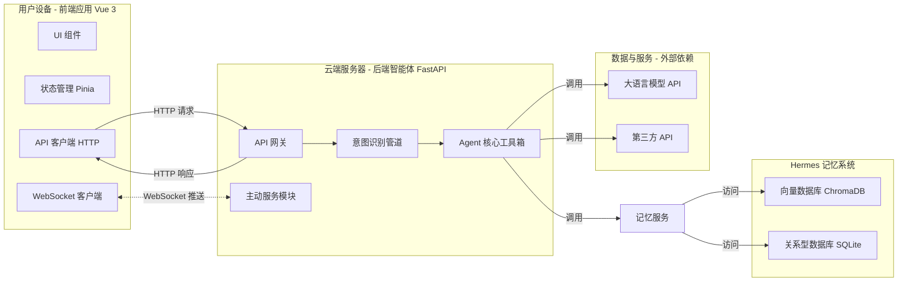
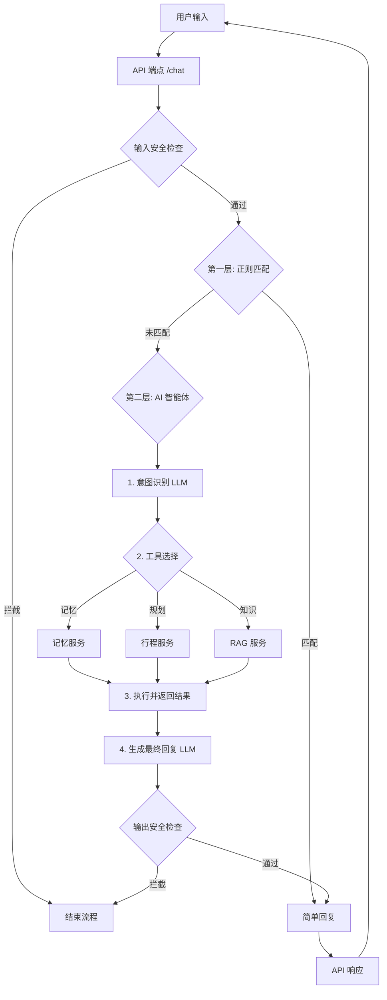

# AI智游伴 (TravelMate) — 从零到一完整实现方案

> 本文档基于《项目架构设计纪要》、系统架构图和数据流工作流程图，设计出项目的完整落地步骤。
> 每一步都明确"做什么、怎么做、产出什么、如何验收"。

---

## 目录

- [系统架构总览](#系统架构总览)
- [数据流与工作流程](#数据流与工作流程)
- [阶段零：工程脚手架搭建与基础设施](#阶段零工程脚手架搭建与基础设施)
- [阶段一：前端对话界面基础](#阶段一前端对话界面基础)
- [阶段二：后端API网关与基础服务](#阶段二后端api网关与基础服务)
- [阶段三：三级意图识别管道（核心）](#阶段三三级意图识别管道核心)
- [阶段四：Hermes记忆系统（核心）](#阶段四hermes记忆系统核心)
- [阶段五：外部API集成——地图与天气](#阶段五外部api集成地图与天气)
- [阶段六：行程规划服务](#阶段六行程规划服务)
- [阶段七：RAG景点知识服务](#阶段七rag景点知识服务)
- [阶段八：主动服务机制（核心）](#阶段八主动服务机制核心)
- [阶段九：前端-后端业务大串联](#阶段九前端-后端业务大串联)
- [阶段十：安全系统完善](#阶段十安全系统完善)
- [阶段十一：语音交互（P1增强）](#阶段十一语音交互p1增强)
- [阶段十二：联调优化、测试与部署](#阶段十二联调优化测试与部署)
- [附录A：完整目录结构](#附录a完整目录结构)
- [附录B：关键技术方案详解](#附录b关键技术方案详解)
- [附录C：里程碑验收总表](#附录c里程碑验收总表)

---

## 系统架构总览

下图展示了 AI智游伴 的完整系统架构，分为用户设备、云端服务器、外部依赖和记忆系统四大板块：



---

## 数据流与工作流程

下图展示了用户一次交互的完整数据流转过程——从输入安全检查、三层意图识别到工具调用与最终回复：



---

## 阶段零：工程脚手架搭建与基础设施

> **目标**：创建完整的项目骨架，让前后端能跑通最基础的 Hello World 链路。

### 0.1 创建项目根目录与 Git 仓库

```bash
# 在 intelligent travel 目录下创建项目根目录
mkdir travelmate
cd travelmate
git init
```

创建 `.gitignore`（包含 `node_modules/`、`__pycache__/`、`.env`、`dist/`、`*.db` 等）。

创建 `README.md`，包含项目名称、简介、技术栈、本地启动方式。

### 0.2 初始化前端工程（Vue 3 + Vite + TypeScript）

```bash
npm create vite@latest frontend -- --template vue-ts
cd frontend
npm install
npm install pinia axios
npm install -D tailwindcss @tailwindcss/vite
```

配置 Tailwind CSS（在 `vite.config.ts` 中添加 Tailwind 插件，在 `style.css` 中引入 `@tailwind` 指令）。

配置 `tsconfig.json` 路径别名（`@` → `src/`）。

验证：`npm run dev` 能在浏览器看到默认 Vite 页面。

### 0.3 初始化后端工程（FastAPI + Python）

```bash
cd backend
python -m venv venv
source venv/bin/activate   # Windows: venv\Scripts\activate
pip install fastapi uvicorn python-dotenv httpx pydantic
```

创建入口文件 `backend/app/main.py`：

```python
from fastapi import FastAPI
from fastapi.middleware.cors import CORSMiddleware

app = FastAPI(title="TravelMate API", version="0.1.0")

app.add_middleware(
    CORSMiddleware,
    allow_origins=["http://localhost:5173"],
    allow_methods=["*"],
    allow_headers=["*"],
)

@app.get("/health")
async def health():
    return {"status": "ok"}
```

创建 `backend/requirements.txt`（通过 `pip freeze > requirements.txt` 生成）。

验证：`uvicorn app.main:app --reload`，访问 `http://localhost:8000/health` 返回 `{"status":"ok"}`。

### 0.4 配置环境变量管理

在 `backend/` 下创建 `.env.example`：

```
DEEPSEEK_API_KEY=your_key_here
DEEPSEEK_BASE_URL=https://api.deepseek.com
AMAP_API_KEY=your_amap_key_here
CHROMA_PERSIST_DIR=./data/chroma
SQLITE_DB_PATH=./data/travelmate.db
```

创建 `backend/.env`（复制 `.env.example` 并填入真实密钥）。

在 `app/core/config.py` 中通过 `pydantic-settings` 读取环境变量：

```python
from pydantic_settings import BaseSettings

class Settings(BaseSettings):
    DEEPSEEK_API_KEY: str
    DEEPSEEK_BASE_URL: str = "https://api.deepseek.com"
    AMAP_API_KEY: str = ""
    CHROMA_PERSIST_DIR: str = "./data/chroma"
    SQLITE_DB_PATH: str = "./data/travelmate.db"

    class Config:
        env_file = ".env"

settings = Settings()
```

### 0.5 创建统一的前端-后端通信脚本

在 `frontend/` 中创建 `src/api/client.ts`：

```typescript
import axios from 'axios'

const api = axios.create({
  baseURL: 'http://localhost:8000',
  timeout: 30000,
})

export default api
```

### 0.6 阶段产出与验收

| 产出物 | 验收标准 |
|--------|----------|
| 前端工程 | `npm run dev` 正常启动，浏览器可访问 |
| 后端工程 | `uvicorn` 启动后 `/health` 返回 200 |
| 环境变量 | `.env` 管理机制生效，密钥不进 Git |
| Git 仓库 | 首次 commit 包含完整脚手架代码 |

---

## 阶段一：前端对话界面基础

> **目标**：构建极简聊天界面，实现基本的对话气泡展示和输入框交互。

### 1.1 设计消息数据模型

在 `frontend/src/types/chat.ts` 中定义：

```typescript
export interface Message {
  id: string
  role: 'user' | 'assistant' | 'system'
  content: string
  timestamp: number
  type: 'text' | 'card' | 'proactive' // 卡片类型用于行程展示
  metadata?: Record<string, any>
}
```

### 1.2 构建聊天状态管理（Pinia Store）

在 `frontend/src/stores/chat.ts` 中创建 `useChatStore`：

- `messages: Message[]` — 当前会话消息列表
- `isLoading: boolean` — 是否正在等待 AI 响应
- `sendMessage(content: string)` — 发送消息并调用后端 API
- `addSystemMessage(msg)` — 接收后端主动推送消息

### 1.3 构建核心 UI 组件

创建以下组件（建议放在 `frontend/src/components/chat/` 下）：

| 组件 | 文件名 | 功能 |
|------|--------|------|
| 聊天容器 | `ChatContainer.vue` | 整体布局：消息列表 + 输入区域 |
| 消息气泡 | `MessageBubble.vue` | 区分 user/assistant/system 样式，支持 Markdown 渲染 |
| 输入框 | `ChatInput.vue` | 文本输入 + 发送按钮，支持 Enter 发送、Shift+Enter 换行 |
| 行程卡片 | `TripCard.vue` | 将 AI 返回的行程渲染为美观的结构化卡片 |

### 1.4 集成 Markdown 渲染

安装依赖：

```bash
npm install markdown-it @types/markdown-it
```

在 `MessageBubble.vue` 中使用 `markdown-it` 将 assistant 消息的 Markdown 文本渲染为 HTML。

### 1.5 实现免登录设备识别

在 `frontend/src/utils/device.ts` 中实现：

```typescript
function getDeviceId(): string {
  let deviceId = localStorage.getItem('travelmate_device_id')
  if (!deviceId) {
    deviceId = 'dev_' + crypto.randomUUID()
    localStorage.setItem('travelmate_device_id', deviceId)
  }
  return deviceId
}
```

每次 API 请求时在 Header 中携带 `X-Device-ID`。

### 1.6 阶段产出与验收

| 产出物 | 验收标准 |
|--------|----------|
| 聊天界面 | 页面打开可见聊天框，可输入并发送文字 |
| 消息气泡 | user/assistant 消息样式不同，Markdown 可渲染 |
| 设备识别 | 刷新页面后 Device ID 保持不变 |
| 前后端联调 | 前端发送消息到后端 /chat 接口，收到模拟回复 |

---

## 阶段二：后端 API 网关与基础服务

> **目标**：搭建后端 API 路由体系，为后续各模块提供统一的请求入口。

### 2.1 规划 API 路由

在 `backend/app/` 下创建模块化目录结构：

```
backend/app/
├── main.py              # FastAPI 入口
├── core/
│   ├── config.py        # 配置管理
│   └── dependencies.py  # 公共依赖注入
├── api/
│   ├── chat.py          # /chat 主对话接口
│   ├── memory.py        # /memory 记忆管理接口
│   ├── trip.py          # /trip 行程相关接口
│   └── proactive.py     # /proactive 主动服务接口
├── services/
│   ├── intent_router.py # 意图识别管道
│   ├── memory_service.py # 记忆服务
│   ├── trip_service.py  # 行程规划服务
│   ├── rag_service.py   # RAG 知识服务
│   └── proactive_service.py # 主动服务模块
├── models/
│   ├── schemas.py       # Pydantic 请求/响应模型
│   └── database.py      # 数据库初始化
├── tools/
│   ├── amap_tool.py     # 高德地图工具
│   └── weather_tool.py  # 天气查询工具
└── utils/
    ├── safety.py        # 安全检查
    └── prompt.py        # Prompt 模板管理
```

### 2.2 定义核心数据模型

在 `backend/app/models/schemas.py` 中：

```python
from pydantic import BaseModel
from typing import Optional, List
from enum import Enum

class ChatRequest(BaseModel):
    message: str
    device_id: str
    session_id: Optional[str] = None

class ChatResponse(BaseModel):
    reply: str
    intent: str
    message_type: str = "text"  # text / card / proactive
    metadata: Optional[dict] = None

class IntentType(str, Enum):
    TRIP_PLAN = "trip_plan"
    WEATHER = "weather"
    PREFERENCE = "preference"
    KNOWLEDGE = "knowledge"
    CHAT = "chat"
    UNKNOWN = "unknown"
```

### 2.3 实现主对话接口（骨架）

在 `backend/app/api/chat.py` 中创建 `/chat` 端点（此阶段仅做消息接收和回显，后续阶段逐步接入意图识别和工具调用）：

```python
from fastapi import APIRouter, Request
from app.models.schemas import ChatRequest, ChatResponse

router = APIRouter()

@router.post("/chat", response_model=ChatResponse)
async def chat_endpoint(req: ChatRequest):
    # 阶段二：仅回显，后续接入意图管道
    return ChatResponse(
        reply=f"收到你的消息：{req.message}",
        intent="chat",
        message_type="text"
    )
```

### 2.4 配置 WebSocket 端点（为阶段八准备）

在 `backend/app/main.py` 中预注册 WebSocket 路由骨架：

```python
from fastapi import WebSocket

@app.websocket("/ws/{device_id}")
async def websocket_endpoint(websocket: WebSocket, device_id: str):
    await websocket.accept()
    try:
        while True:
            data = await websocket.receive_text()
            await websocket.send_text(f"Echo: {data}")
    except:
        pass
```

### 2.5 实现 SQLite 数据库初始化

创建 `backend/app/models/database.py`：

```python
import sqlite3
from app.core.config import settings

def get_db() -> sqlite3.Connection:
    conn = sqlite3.connect(settings.SQLITE_DB_PATH)
    conn.row_factory = sqlite3.Row
    return conn

def init_db():
    conn = get_db()
    conn.executescript("""
        CREATE TABLE IF NOT EXISTS devices (
            device_id TEXT PRIMARY KEY,
            created_at TIMESTAMP DEFAULT CURRENT_TIMESTAMP
        );
        CREATE TABLE IF NOT EXISTS conversations (
            id INTEGER PRIMARY KEY AUTOINCREMENT,
            device_id TEXT,
            session_id TEXT,
            role TEXT,
            content TEXT,
            intent TEXT,
            created_at TIMESTAMP DEFAULT CURRENT_TIMESTAMP
        );
        CREATE TABLE IF NOT EXISTS user_preferences (
            id INTEGER PRIMARY KEY AUTOINCREMENT,
            device_id TEXT,
            category TEXT,
            key TEXT,
            value TEXT,
            confidence REAL DEFAULT 1.0,
            source TEXT,
            created_at TIMESTAMP DEFAULT CURRENT_TIMESTAMP,
            updated_at TIMESTAMP DEFAULT CURRENT_TIMESTAMP
        );
        CREATE TABLE IF NOT EXISTS trip_plans (
            id INTEGER PRIMARY KEY AUTOINCREMENT,
            device_id TEXT,
            destination TEXT,
            days INTEGER,
            plan_json TEXT,
            created_at TIMESTAMP DEFAULT CURRENT_TIMESTAMP
        );
    """)
    conn.commit()
    conn.close()
```

在 `main.py` 的 `startup` 事件中调用 `init_db()`。

### 2.6 阶段产出与验收

| 产出物 | 验收标准 |
|--------|----------|
| API 路由体系 | `/chat`、`/memory`、`/trip`、`/proactive` 路由就位 |
| 数据模型 | Pydantic schema 定义完整，类型安全 |
| SQLite 数据库 | 启动后自动建表，包含 devices/conversations/user_preferences/trip_plans |
| 前后端联调 | 前端发送消息 → 后端回显 → 前端展示（完整闭环） |

---

## 阶段三：三级意图识别管道（核心）

> **目标**：实现数据流图中定义的三级意图识别架构——正则快速匹配 + AI 智能体识别 + 安全检查。

### 3.1 第一层：正则快速匹配

创建 `backend/app/services/regex_matcher.py`：

```python
import re
from typing import Optional, Tuple

# 词库定义
GREETING_PATTERNS = [
    r"^(你好|您好|嗨|hi|hello|hey|哈喽)[！!？?。.]*$",
]

FAREWELL_PATTERNS = [
    r"^(再见|拜拜|bye|goodbye|下次见)[！!？?。.]*$",
]

THANKS_PATTERNS = [
    r"^(谢谢|感谢|多谢|thanks|thx)[你您！!？?。.]*$",
]

CONFIRM_PATTERNS = [
    r"^(好的|没问题|ok|嗯|可以|行)[！!？?。.]*$",
]

# ... 更多词库分类（参照意图识别方案文档）

MATCHERS = [
    ("greeting", GREETING_PATTERNS, "你好呀！我是 AI 智游伴，你的专属旅行助手。有什么旅行问题可以问我哦～"),
    ("farewell", FAREWELL_PATTERNS, "再见！祝你旅途愉快，期待下次为你服务～"),
    ("thanks", THANKS_PATTERNS, "不客气！能帮到你我也很开心～"),
    ("confirm", CONFIRM_PATTERNS, "好的，收到！"),
]

def regex_match(text: str) -> Optional[Tuple[str, str]]:
    """第一层正则匹配，返回 (intent, response) 或 None"""
    text = text.strip()
    if len(text) > 50:  # 超过50字不走正则，直接进AI
        return None
    for intent, patterns, response in MATCHERS:
        for pattern in patterns:
            if re.match(pattern, text, re.IGNORECASE):
                return (intent, response)
    return None
```

### 3.2 第二层：AI 意图识别（LLM 调用）

创建 `backend/app/services/intent_router.py`：

```python
import json
from app.services.regex_matcher import regex_match
from app.services.llm_client import call_llm
from app.utils.safety import input_safety_check
from app.models.schemas import IntentType

INTENT_RECOGNITION_PROMPT = """你是「AI智游伴」的意图识别引擎。

你的任务是分析用户输入，将其归类到以下意图类别之一，并提取关键参数。

## 意图分类体系

| 意图类别 | 代码 | 子意图 | 说明 |
|----------|------|--------|------|
| 行程规划 | TRIP_PLAN | trip_create / trip_modify / trip_query | 创建、修改或查询旅行计划 |
| 天气查询 | WEATHER | weather_current / weather_forecast | 查询当前天气或未来天气 |
| 偏好记录 | PREFERENCE | pref_set / pref_query | 用户设置或查询个人偏好（饮食、预算等） |
| 景点知识 | KNOWLEDGE | spot_intro / spot_nearby / spot_history | 景点介绍、周边查询、历史故事 |
| 闲聊问答 | CHAT | chat_general / chat_travel_tips | 普通对话、旅行小贴士 |

## 输出格式（严格 JSON）

{
  "intent": "意图代码",
  "sub_intent": "子意图代码",
  "confidence": 0.0-1.0,
  "reasoning": "简要推理过程",
  "extracted_data": {
    // 根据意图不同提取不同字段
    // TRIP_PLAN: {"destination": "...", "days": N, "budget": N, "preferences": ["..."]}
    // WEATHER: {"city": "...", "date": "..."}
    // PREFERENCE: {"category": "...", "key": "...", "value": "..."}
    // KNOWLEDGE: {"spot_name": "...", "info_type": "..."}
    // CHAT: {}
  }
}

## 意图优先级规则
1. PREFERENCE（用户明确表达偏好变更时最高优先）
2. TRIP_PLAN（包含目的地、天数等旅行规划关键词）
3. WEATHER（包含天气相关关键词）
4. KNOWLEDGE（包含景点名称或询问景点信息）
5. CHAT（以上都不匹配时）

## 用户消息
{user_message}

## 用户历史偏好（供参考）
{user_preferences}
"""
```

### 3.3 创建 LLM 客户端封装

创建 `backend/app/services/llm_client.py`：

```python
import httpx
from app.core.config import settings

async def call_llm(
    messages: list[dict],
    system_prompt: str = "",
    temperature: float = 0.3,
    max_tokens: int = 2000,
) -> str:
    """调用 DeepSeek API"""
    full_messages = []
    if system_prompt:
        full_messages.append({"role": "system", "content": system_prompt})
    full_messages.extend(messages)

    async with httpx.AsyncClient(timeout=60) as client:
        response = await client.post(
            f"{settings.DEEPSEEK_BASE_URL}/v1/chat/completions",
            headers={
                "Authorization": f"Bearer {settings.DEEPSEEK_API_KEY}",
                "Content-Type": "application/json",
            },
            json={
                "model": "deepseek-chat",
                "messages": full_messages,
                "temperature": temperature,
                "max_tokens": max_tokens,
            }
        )
        response.raise_for_status()
        return response.json()["choices"][0]["message"]["content"]
```

### 3.4 第三层：输入/输出安全检查

创建 `backend/app/utils/safety.py`：

```python
# 旅行场景安全检查规则

BLOCK_KEYWORDS = [
    # 违法违规
    "怎么偷", "怎么骗", "怎么逃票", "怎么逃单",
    # 危险行为
    "翻越围栏", "闯红灯", "禁止进入",
]

WARN_KEYWORDS = [
    # 高风险提醒
    ("独自旅行", "独自旅行请注意安全，建议告知家人朋友你的行程。"),
    ("夜路", "夜间出行建议使用正规交通工具，注意人身安全。"),
    ("偏远地区", "前往偏远地区建议提前告知他人行程，携带必要物资。"),
]

URGENT_KEYWORDS = [
    "高原反应", "中暑", "溺水", "食物中毒", "受伤",
]

def input_safety_check(text: str) -> dict:
    """输入安全检查"""
    for keyword in BLOCK_KEYWORDS:
        if keyword in text:
            return {"passed": False, "level": "BLOCK", "reason": f"包含违禁内容：{keyword}"}
    for keyword, msg in WARN_KEYWORDS:
        if keyword in text:
            return {"passed": True, "level": "WARN", "warning": msg}
    for keyword in URGENT_KEYWORDS:
        if keyword in text:
            return {"passed": True, "level": "URGENT", "warning": f"检测到「{keyword}」相关表述，如您遇到紧急情况请拨打110或120。"}
    return {"passed": True, "level": "SAFE"}

def output_safety_check(text: str) -> dict:
    """输出安全检查——确保 AI 回复不包含危险信息"""
    # 检查回复中是否包含鼓励危险行为的内容
    dangerous_phrases = ["建议你去翻越", "可以尝试逃票", "不用担心安全"]
    for phrase in dangerous_phrases:
        if phrase in text:
            return {"passed": False, "reason": f"回复包含不当内容：{phrase}"}
    return {"passed": True}
```

### 3.5 组装完整意图管道

将三层串联起来，在 `intent_router.py` 中实现 `route_intent()` 方法：

```python
async def route_intent(user_message: str, device_id: str) -> dict:
    """
    完整意图识别管道：
    输入安全检查 → 第一层正则 → 第二层AI → 输出安全检查 → 返回结果
    """
    # 0. 输入安全检查
    safety = input_safety_check(user_message)
    if not safety["passed"]:
        return {"intent": "blocked", "reply": "抱歉，我无法处理这类请求。如果你遇到了旅行中的问题，我很乐意帮你解决。", "safety": safety}

    # 1. 第一层：正则快速匹配
    regex_result = regex_match(user_message)
    if regex_result:
        intent, reply = regex_result
        return {"intent": intent, "reply": reply, "layer": "regex"}

    # 2. 第二层：AI 意图识别
    intent_prompt = INTENT_RECOGNITION_PROMPT.format(
        user_message=user_message,
        user_preferences=get_user_preferences(device_id),
    )
    raw_response = await call_llm(
        messages=[{"role": "user", "content": user_message}],
        system_prompt=intent_prompt,
        temperature=0.1,
        max_tokens=500,
    )

    # 解析 AI 返回的 JSON
    intent_data = json.loads(raw_response)

    # 3. 输出安全检查
    output_safety = output_safety_check(raw_response)

    return {
        "intent": intent_data["intent"],
        "sub_intent": intent_data["sub_intent"],
        "confidence": intent_data["confidence"],
        "reasoning": intent_data["reasoning"],
        "extracted_data": intent_data.get("extracted_data", {}),
        "layer": "ai",
        "safety": output_safety,
    }
```

### 3.6 验收标准

| 产出物 | 验收标准 |
|--------|----------|
| 正则匹配层 | "你好"/"hi"/"再见" 等能秒级返回，无需调用 LLM |
| AI 识别层 | "我想去杭州玩3天" 识别为 TRIP_PLAN，提取 destination=杭州, days=3 |
| AI 识别层 | "附近有什么好吃的" 识别为 KNOWLEDGE/spot_nearby |
| AI 识别层 | "我不吃辣" 识别为 PREFERENCE，提取 category=饮食, key=忌口, value=辣 |
| 安全检查层 | 包含危险关键词的消息被拦截或警告 |
| 三层串联 | 正则未匹配时自动回退到 AI 层 |

---

## 阶段四：Hermes 记忆系统（核心）

> **目标**：实现系统架构图中的"记忆服务"模块，使用 ChromaDB（向量）+ SQLite（结构化）双引擎存储。

### 4.1 安装依赖

```bash
pip install chromadb sentence-transformers --break-system-packages
```

### 4.2 初始化 ChromaDB 向量数据库

创建 `backend/app/services/memory_service.py`：

```python
import chromadb
from app.core.config import settings
from app.models.database import get_db
import json
from datetime import datetime

# 初始化 ChromaDB
chroma_client = chromadb.PersistentClient(path=settings.CHROMA_PERSIST_DIR)
user_memory_collection = chroma_client.get_or_create_collection(
    name="user_memories",
    metadata={"hnsw:space": "cosine"}
)
```

### 4.3 实现记忆写入

```python
def save_memory(device_id: str, category: str, key: str, value: str, source: str = "conversation"):
    """
    双写：SQLite 存结构化数据 + ChromaDB 存向量化数据
    """
    # 1. 写入 SQLite（结构化）
    db = get_db()
    db.execute(
        "INSERT INTO user_preferences (device_id, category, key, value, source) VALUES (?, ?, ?, ?, ?)",
        (device_id, category, key, value, source)
    )
    db.commit()
    db.close()

    # 2. 写入 ChromaDB（向量化，用于语义检索）
    doc_text = f"用户偏好：{category}-{key}：{value}"
    doc_id = f"{device_id}_{category}_{key}"
    user_memory_collection.upsert(
        ids=[doc_id],
        documents=[doc_text],
        metadatas=[{"device_id": device_id, "category": category, "key": key}]
    )
```

### 4.4 实现记忆检索

```python
def query_memory(device_id: str, query_text: str, top_k: int = 5) -> list[dict]:
    """语义检索用户记忆"""
    results = user_memory_collection.query(
        query_texts=[query_text],
        n_results=top_k,
        where={"device_id": device_id}
    )
    memories = []
    if results["documents"] and results["documents"][0]:
        for doc, meta in zip(results["documents"][0], results["metadatas"][0]):
            memories.append({
                "text": doc,
                "category": meta.get("category"),
                "key": meta.get("key"),
            })
    return memories

def get_all_preferences(device_id: str) -> list[dict]:
    """获取用户所有偏好（从 SQLite）"""
    db = get_db()
    rows = db.execute(
        "SELECT category, key, value, confidence FROM user_preferences WHERE device_id = ? ORDER BY updated_at DESC",
        (device_id,)
    ).fetchall()
    db.close()
    return [dict(row) for row in rows]
```

### 4.5 实现记忆更新与遗忘机制

```python
def update_memory(device_id: str, category: str, key: str, new_value: str):
    """更新已有偏好"""
    db = get_db()
    db.execute(
        """UPDATE user_preferences SET value = ?, updated_at = CURRENT_TIMESTAMP, confidence = MIN(confidence + 0.1, 1.0)
        WHERE device_id = ? AND category = ? AND key = ?""",
        (new_value, device_id, category, key)
    )
    db.commit()
    db.close()
    # 同步更新向量库
    doc_text = f"用户偏好：{category}-{key}：{new_value}"
    doc_id = f"{device_id}_{category}_{key}"
    user_memory_collection.upsert(
        ids=[doc_id],
        documents=[doc_text],
        metadatas=[{"device_id": device_id, "category": category, "key": key}]
    )

def forget_memory(device_id: str, category: str = None, key: str = None):
    """删除记忆"""
    db = get_db()
    if category and key:
        db.execute("DELETE FROM user_preferences WHERE device_id = ? AND category = ? AND key = ?",
                   (device_id, category, key))
        user_memory_collection.delete(ids=[f"{device_id}_{category}_{key}"])
    elif category:
        db.execute("DELETE FROM user_preferences WHERE device_id = ? AND category = ?", (device_id, category))
    db.commit()
    db.close()
```

### 4.6 将记忆服务接入意图管道

在 `intent_router.py` 中，当意图识别为 `PREFERENCE` 时，调用 `save_memory()`；当识别为其他意图时，调用 `query_memory()` 获取相关上下文注入 Prompt。

### 4.7 验收标准

| 产出物 | 验收标准 |
|--------|----------|
| 记忆写入 | 用户说"我不吃辣" → SQLite 和 ChromaDB 同时写入 |
| 语义检索 | 问"附近有什么好吃的" → 自动检索出"不吃辣"偏好 |
| 记忆更新 | 用户改口"其实我现在可以吃微辣" → 更新原有记录 |
| 跨会话持久 | 关闭并重启后端，偏好数据仍在 |
| API 接口 | `/memory/preferences` 返回用户全部偏好列表 |

---

## 阶段五：外部 API 集成——地图与天气

> **目标**：实现数据流图中"工具箱"对外部 API 的调用能力。

### 5.1 申请并配置 API Key

- 高德地图 Web 服务 API：在 https://console.amap.com 申请，获取 Key
- 在 `.env` 中配置 `AMAP_API_KEY`

### 5.2 实现高德地图工具

创建 `backend/app/tools/amap_tool.py`：

```python
import httpx
from app.core.config import settings

AMAP_BASE = "https://restapi.amap.com/v3"

async def search_poi(keywords: str, city: str = "", types: str = "", page: int = 1) -> list[dict]:
    """POI 地点搜索"""
    async with httpx.AsyncClient() as client:
        resp = await client.get(f"{AMAP_BASE}/place/text", params={
            "key": settings.AMAP_API_KEY,
            "keywords": keywords,
            "city": city,
            "types": types,
            "offset": 5,
            "page": page,
        })
        data = resp.json()
        if data.get("status") == "1" and data.get("pois"):
            return [{"name": p["name"], "address": p["address"],
                     "location": p["location"], "type": p.get("type", "")}
                    for p in data["pois"]]
    return []

async def geocode(address: str) -> dict | None:
    """地理编码：地址 → 经纬度"""
    async with httpx.AsyncClient() as client:
        resp = await client.get(f"{AMAP_BASE}/geocode/geo", params={
            "key": settings.AMAP_API_KEY,
            "address": address,
        })
        data = resp.json()
        if data.get("geocodes"):
            geo = data["geocodes"][0]
            return {"location": geo["location"], "formatted_address": geo.get("formatted_address", "")}
    return None

async def get_nearby_food(location: str, radius: int = 1000) -> list[dict]:
    """搜索附近餐厅"""
    return await search_poi(keywords="餐厅", city="", types="050000",
                           page=1)
```

### 5.3 实现天气查询工具

创建 `backend/app/tools/weather_tool.py`：

```python
import httpx
from app.core.config import settings

AMAP_BASE = "https://restapi.amap.com/v3"

async def get_weather(city: str) -> dict | None:
    """通过高德天气 API 查询天气"""
    async with httpx.AsyncClient() as client:
        resp = await client.get(f"{AMAP_BASE}/weather/weatherInfo", params={
            "key": settings.AMAP_API_KEY,
            "city": city,
            "extensions": "all",  # all=预报, base=实况
        })
        data = resp.json()
        if data.get("status") == "1" and data.get("lives"):
            live = data["lives"][0]
            forecasts = data.get("forecasts", [{}])[0].get("casts", [])
            return {
                "city": live.get("city"),
                "weather": live.get("weather"),
                "temperature": live.get("temperature"),
                "wind": live.get("winddirection"),
                "humidity": live.get("humidity"),
                "forecast": forecasts[:3] if forecasts else []
            }
    return None
```

### 5.4 注册为 Agent 工具

在 `backend/app/services/tool_registry.py` 中注册可用工具：

```python
from app.tools.amap_tool import search_poi, get_nearby_food, geocode
from app.tools.weather_tool import get_weather

TOOLS = {
    "search_poi": {
        "function": search_poi,
        "description": "搜索指定关键词的地点（餐厅、景点、酒店等）",
        "parameters": {
            "keywords": "搜索关键词",
            "city": "城市名称（可选）",
        }
    },
    "get_nearby_food": {
        "function": get_nearby_food,
        "description": "搜索附近的餐厅",
        "parameters": {"location": "经纬度", "radius": "搜索半径(米)"},
    },
    "get_weather": {
        "function": get_weather,
        "description": "查询指定城市的天气预报",
        "parameters": {"city": "城市名称"},
    },
    "geocode": {
        "function": geocode,
        "description": "将地址转换为经纬度坐标",
        "parameters": {"address": "详细地址"},
    },
}
```

### 5.5 验收标准

| 产出物 | 验收标准 |
|--------|----------|
| POI 搜索 | 调用 search_poi("西湖", "杭州") 返回西湖相关景点列表 |
| 天气查询 | 调用 get_weather("杭州") 返回温度、天气状况、未来三天预报 |
| 地理编码 | 调用 geocode("杭州西湖") 返回经纬度坐标 |
| 工具注册 | tools 字典可被 Agent 核心按名称调用 |

---

## 阶段六：行程规划服务

> **目标**：实现核心的行程自动生成功能——用户输入目的地和天数，AI 结合地图数据生成结构化行程。

### 6.1 设计行程数据结构

```python
class TripDay(BaseModel):
    day: int
    theme: str  # 如"西湖经典一日"
    schedule: list[dict]  # [{"time": "09:00", "activity": "...", "location": "...", "tips": "..."}]

class TripPlan(BaseModel):
    destination: str
    total_days: int
    daily_budget: float
    overview: str
    days: list[TripDay]
    tips: list[str]
```

### 6.2 实现行程生成 Prompt

创建 `backend/app/utils/prompt.py`：

```python
TRIP_PLAN_PROMPT = """你是一位专业的旅行规划师，正在为用户制定行程。

## 用户信息
- 目的地：{destination}
- 天数：{days} 天
- 每日预算：约 {budget} 元
- 用户偏好：{preferences}
- 当前天气：{weather_info}

## 可用景点（来自高德地图数据）
{poi_data}

## 要求
1. 行程安排合理，考虑景点间的距离和交通时间
2. 根据用户偏好（如饮食禁忌）调整推荐内容
3. 每天的行程控制在 3-5 个景点，避免过于紧凑
4. 给出实用的旅行小贴士

## 输出格式（JSON）
{{
  "overview": "行程总览描述",
  "days": [
    {{
      "day": 1,
      "theme": "主题",
      "schedule": [
        {{
          "time": "09:00",
          "activity": "活动描述",
          "location": "地点",
          "tips": "小贴士"
        }}
      ]
    }}
  ],
  "tips": ["旅行建议1", "旅行建议2"]
}}
"""
```

### 6.3 实现 TripService

创建 `backend/app/services/trip_service.py`：

```python
import json
from app.services.llm_client import call_llm
from app.services.memory_service import get_all_preferences
from app.tools.amap_tool import search_poi, geocode
from app.tools.weather_tool import get_weather
from app.utils.prompt import TRIP_PLAN_PROMPT
from app.models.database import get_db

async def generate_trip_plan(device_id: str, destination: str, days: int, budget: float = 300) -> dict:
    """生成旅行行程"""
    # 1. 获取用户偏好
    prefs = get_all_preferences(device_id)
    pref_text = "、".join([f"{p['key']}：{p['value']}" for p in prefs]) or "无特殊偏好"

    # 2. 获取目的地 POI 数据
    pois = await search_poi(destination, types="110000|120000|141200")  # 景点、酒店、餐饮
    poi_text = "\n".join([f"- {p['name']} ({p['address']})" for p in pois]) or "暂无数据"

    # 3. 获取天气
    weather = await get_weather(destination)
    weather_text = f"{weather['weather']}，{weather['temperature']}°C" if weather else "暂无天气数据"

    # 4. 调用 LLM 生成行程
    prompt = TRIP_PLAN_PROMPT.format(
        destination=destination, days=days, budget=budget,
        preferences=pref_text, weather_info=weather_text, poi_data=poi_text
    )
    raw = await call_llm(
        messages=[{"role": "user", "content": f"请为我规划{destination}{days}天的旅行行程"}],
        system_prompt=prompt,
        temperature=0.7,
        max_tokens=3000,
    )

    # 5. 解析并存储
    plan_data = json.loads(raw)
    db = get_db()
    db.execute(
        "INSERT INTO trip_plans (device_id, destination, days, plan_json) VALUES (?, ?, ?, ?)",
        (device_id, destination, days, json.dumps(plan_data, ensure_ascii=False))
    )
    db.commit()
    db.close()

    return plan_data
```

### 6.4 实现行程修改与查询

```python
async def query_trip_plans(device_id: str) -> list[dict]:
    """查询用户所有行程"""
    db = get_db()
    rows = db.execute(
        "SELECT * FROM trip_plans WHERE device_id = ? ORDER BY created_at DESC",
        (device_id,)
    ).fetchall()
    db.close()
    return [{"id": r["id"], "destination": r["destination"],
             "days": r["days"], "plan": json.loads(r["plan_json"]),
             "created_at": r["created_at"]} for r in rows]

async def modify_trip_plan(plan_id: int, modification: str) -> dict:
    """修改行程（AI 重新生成调整部分）"""
    # ... 调用 LLM 对已有行程进行修改
```

### 6.5 验收标准

| 产出物 | 验收标准 |
|--------|----------|
| 行程生成 | 输入"去杭州3天" → 返回含景点、时间、Tips 的结构化 JSON |
| POI 融合 | 行程中的景点来源于真实高德 POI 数据 |
| 偏好影响 | 若用户设置了"不吃辣"，行程中的餐饮推荐避开辣菜 |
| 天气融入 | 行程中包含天气相关信息（如"第二天有雨，建议带伞"） |
| 持久化 | 生成的行程存储在 SQLite，可通过 API 查询 |

---

## 阶段七：RAG 景点知识服务

> **目标**：为景点讲解提供基于知识库的深度问答能力。

### 7.1 准备景点知识库

创建 `backend/data/knowledge/` 目录，准备景点文档（每个景点一个 Markdown 文件）：

```
backend/data/knowledge/
├── 西湖.md
├── 雷峰塔.md
├── 断桥.md
├── 灵隐寺.md
└── ... （每个文档包含景点的历史、文化、游玩建议等）
```

示例内容（`西湖.md`）：

```markdown
# 西湖

## 基本信息
西湖位于浙江省杭州市西部，是中国著名的风景名胜区，2011年被列入世界文化遗产名录。

## 历史文化
西湖有"人间天堂"之美誉，白居易、苏东坡等文人墨客在此留下了大量诗篇。

## 经典景观
- 苏堤春晓：苏东坡任杭州知州时修建，春日漫步堤上，桃红柳绿。
- 断桥残雪：西湖十景之一，因《白蛇传》传说而闻名。
- 三潭印月：西湖中最大的岛屿，中秋赏月绝佳去处。

## 游玩建议
- 建议游览时间：半天至一天
- 最佳季节：春季（3-5月）和秋季（9-11月）
- 交通：可乘坐地铁1号线到龙翔桥站
```

### 7.2 构建 RAG 服务

创建 `backend/app/services/rag_service.py`：

```python
import os
import chromadb
from app.core.config import settings
from app.services.llm_client import call_llm

# 初始化知识库向量集合
rag_client = chromadb.PersistentClient(path=settings.CHROMA_PERSIST_DIR)
knowledge_collection = rag_client.get_or_create_collection(
    name="spot_knowledge",
    metadata={"hnsw:space": "cosine"}
)

def load_knowledge_base():
    """启动时加载知识库文档"""
    knowledge_dir = os.path.join(os.path.dirname(__file__), "../../data/knowledge")
    if not os.path.exists(knowledge_dir):
        os.makedirs(knowledge_dir)
        return

    for filename in os.listdir(knowledge_dir):
        if filename.endswith(".md"):
            filepath = os.path.join(knowledge_dir, filename)
            with open(filepath, "r", encoding="utf-8") as f:
                content = f.read()

            # 按段落分块
            chunks = [chunk.strip() for chunk in content.split("\n\n") if chunk.strip()]
            spot_name = filename.replace(".md", "")

            for i, chunk in enumerate(chunks):
                knowledge_collection.upsert(
                    ids=[f"{spot_name}_{i}"],
                    documents=[chunk],
                    metadatas=[{"spot_name": spot_name, "chunk_index": i}]
                )

async def query_knowledge(spot_name: str = "", user_question: str = "") -> str:
    """检索知识库并生成回答"""
    query_text = user_question or f"关于{spot_name}的介绍"

    # 1. 向量检索
    results = knowledge_collection.query(
        query_texts=[query_text],
        n_results=5,
        where={"spot_name": spot_name} if spot_name else None,
    )

    context = "\n\n".join(results["documents"][0]) if results["documents"] and results["documents"][0] else "暂无相关知识。"

    # 2. LLM 生成回答
    answer = await call_llm(
        messages=[{"role": "user", "content": user_question or f"请详细介绍一下{spot_name}"}],
        system_prompt=f"""你是「AI智游伴」的景点讲解员。请基于以下知识库内容回答用户问题。

## 知识库内容
{context}

要求：回答生动有趣，像一位博学的导游在讲解。如果知识库中没有相关信息，请坦诚说明并给出一般性建议。""",
        temperature=0.7,
        max_tokens=1000,
    )
    return answer
```

### 7.3 在 main.py 启动时加载知识库

```python
@app.on_event("startup")
async def startup_event():
    init_db()
    load_knowledge_base()  # 加载景点知识库
```

### 7.4 验收标准

| 产出物 | 验收标准 |
|--------|----------|
| 知识库加载 | 启动时自动扫描 data/knowledge/ 目录，将文档向量化入库 |
| 知识检索 | 问"西湖有什么历史" → 检索到西湖相关段落 |
| 生动回答 | AI 基于检索结果生成导游风格的讲解 |
| 新增景点 | 添加新的 .md 文件后重启即可生效 |

---

## 阶段八：主动服务机制（核心）

> **目标**：实现系统架构图中的"主动服务模块"——基于时间和位置的主动推送。

### 8.1 安装 APScheduler

```bash
pip install apscheduler --break-system-packages
```

### 8.2 创建主动服务管理器

创建 `backend/app/services/proactive_service.py`：

```python
from apscheduler.schedulers.asyncio import AsyncIOScheduler
from app.models.database import get_db
from app.services.memory_service import get_all_preferences
from app.services.llm_client import call_llm
from datetime import datetime
import json

scheduler = AsyncIOScheduler()

# 存储 WebSocket 连接：{device_id: websocket}
active_connections: dict = {}

def register_connection(device_id: str, websocket):
    active_connections[device_id] = websocket

def unregister_connection(device_id: str):
    active_connections.pop(device_id, None)

async def send_proactive_message(device_id: str, message: str, msg_type: str = "proactive"):
    """通过 WebSocket 推送主动消息"""
    ws = active_connections.get(device_id)
    if ws:
        payload = json.dumps({
            "type": msg_type,
            "content": message,
            "timestamp": datetime.now().isoformat(),
        })
        await ws.send_text(payload)

async def check_and_send_weather_reminder(device_id: str, destination: str):
    """检查天气并主动提醒"""
    from app.tools.weather_tool import get_weather
    weather = await get_weather(destination)
    if weather and weather.get("weather") in ["雨", "大雨", "暴雨", "雷阵雨"]:
        prefs = get_all_preferences(device_id)
        reminder = f"明天{destination}有{weather['weather']}，记得带伞哦！"
        if any(p["key"] == "带娃" and p["value"] == "是" for p in prefs):
            reminder += " 雨天路滑，带小朋友出行请格外注意安全。"
        await send_proactive_message(device_id, reminder)

async def check_and_send_spot_greeting(device_id: str, spot_name: str):
    """到达景点时主动问候"""
    greeting_templates = [
        "你已到达{spot}！相传这里有很多有趣的故事，需要我为你讲解一下吗？",
        "哇，你来到了{spot}！这里是当地必打卡的景点，想听听它的历史吗？",
    ]
    import random
    template = random.choice(greeting_templates)
    greeting = template.format(spot=spot_name)
    await send_proactive_message(device_id, greeting)

def schedule_daily_weather_check(device_id: str, destination: str, hour: int = 20):
    """设置每日天气检查定时任务"""
    scheduler.add_job(
        check_and_send_weather_reminder,
        'cron',
        hour=hour,
        minute=0,
        args=[device_id, destination],
        id=f"weather_{device_id}",
        replace_existing=True,
    )
```

### 8.3 升级 WebSocket 端点

更新 `main.py` 中的 WebSocket 端点：

```python
from app.services.proactive_service import register_connection, unregister_connection

@app.websocket("/ws/{device_id}")
async def websocket_endpoint(websocket: WebSocket, device_id: str):
    await websocket.accept()
    register_connection(device_id, websocket)
    try:
        while True:
            data = await websocket.receive_text()
            # 处理客户端心跳等消息
    except WebSocketDisconnect:
        unregister_connection(device_id)
```

### 8.4 在 FastAPI 启动时初始化调度器

```python
@app.on_event("startup")
async def startup_event():
    init_db()
    load_knowledge_base()
    scheduler.start()

@app.on_event("shutdown")
async def shutdown_event():
    scheduler.shutdown()
```

### 8.5 实现主动服务 API

```python
# backend/app/api/proactive.py
from fastapi import APIRouter, Request
from app.services.proactive_service import schedule_daily_weather_check, check_and_send_spot_greeting

router = APIRouter()

@router.post("/proactive/set-weather-check")
async def set_weather_check(req: Request):
    body = await req.json()
    schedule_daily_weather_check(body["device_id"], body["destination"], body.get("hour", 20))
    return {"status": "scheduled"}

@router.post("/proactive/simulate-arrival")
async def simulate_arrival(req: Request):
    body = await req.json()
    await check_and_send_spot_greeting(body["device_id"], body["spot_name"])
    return {"status": "sent"}
```

### 8.6 验收标准

| 产出物 | 验收标准 |
|--------|----------|
| WebSocket 推送 | 前端连接 WS 后，后端可通过 API 推送消息到前端 |
| 天气定时提醒 | 设置每天20:00检查天气，有雨时自动推送提醒 |
| 景点到达问候 | 调用 simulate-arrival → 前端收到景点问候消息 |
| 主动消息样式 | 前端以独特的"系统消息"样式展示主动推送 |

---

## 阶段九：前端-后端业务大串联

> **目标**：将前八个阶段的所有模块串联起来，形成完整的业务闭环。

### 9.1 前端集成 WebSocket

在 `frontend/src/composables/useWebSocket.ts` 中：

```typescript
import { ref, onMounted, onUnmounted } from 'vue'
import { useChatStore } from '@/stores/chat'

export function useWebSocket(deviceId: string) {
  const connected = ref(false)
  const chatStore = useChatStore()
  let ws: WebSocket | null = null

  function connect() {
    ws = new WebSocket(`ws://localhost:8000/ws/${deviceId}`)
    ws.onopen = () => { connected.value = true }
    ws.onmessage = (event) => {
      const data = JSON.parse(event.data)
      chatStore.addSystemMessage(data.content, data.type)
    }
    ws.onclose = () => { connected.value = false }
  }

  onMounted(connect)
  onUnmounted(() => { ws?.close() })

  return { connected }
}
```

### 9.2 前端消息发送流程优化

更新 `useChatStore` 的 `sendMessage` 方法，完善异常处理和加载状态：

```typescript
async sendMessage(content: string) {
  this.isLoading = true
  try {
    // 1. 添加用户消息到界面
    this.messages.push({
      id: crypto.randomUUID(),
      role: 'user',
      content,
      timestamp: Date.now(),
      type: 'text',
    })

    // 2. 发送到后端
    const res = await api.post('/chat', {
      message: content,
      device_id: getDeviceId(),
      session_id: this.sessionId,
    })

    // 3. 根据返回类型渲染
    this.messages.push({
      id: crypto.randomUUID(),
      role: 'assistant',
      content: res.data.reply,
      timestamp: Date.now(),
      type: res.data.message_type,
      metadata: res.data.metadata,
    })
  } catch (error) {
    // 错误处理
  } finally {
    this.isLoading = false
  }
}
```

### 9.3 行程卡片组件开发

完善 `TripCard.vue`，将 AI 返回的结构化行程数据渲染为美观的卡片：

```vue
<template>
  <div class="trip-card bg-white rounded-xl shadow-md p-4 my-2">
    <div class="header text-lg font-bold text-indigo-600">
      🗺️ {{ plan.destination }} {{ plan.total_days }}日游
    </div>
    <div class="budget text-sm text-gray-500">预算参考：约 ¥{{ plan.daily_budget }}/天</div>
    <div v-for="day in plan.days" :key="day.day" class="day-section mt-3">
      <div class="day-title font-semibold">Day {{ day.day }}：{{ day.theme }}</div>
      <div v-for="(item, idx) in day.schedule" :key="idx" class="schedule-item pl-4 py-1 text-sm">
        <span class="time text-gray-400">{{ item.time }}</span>
        <span class="activity ml-2">{{ item.activity }}</span>
      </div>
    </div>
    <div class="tips mt-3 bg-amber-50 rounded p-2 text-sm" v-if="plan.tips?.length">
      <div v-for="(tip, idx) in plan.tips" :key="idx">💡 {{ tip }}</div>
    </div>
  </div>
</template>
```

### 9.4 实现消息类型分支处理

在后端 `chat.py` 中，将意图路由与具体服务对接：

```python
@router.post("/chat", response_model=ChatResponse)
async def chat_endpoint(req: ChatRequest):
    # 1. 意图识别
    intent_result = await route_intent(req.message, req.device_id)

    # 2. 根据意图分发处理
    if intent_result["intent"] == "blocked":
        return ChatResponse(reply=intent_result["reply"], intent="blocked")

    if intent_result["intent"] == "greeting" or intent_result.get("layer") == "regex":
        return ChatResponse(reply=intent_result["reply"], intent=intent_result["intent"])

    extracted = intent_result.get("extracted_data", {})

    if intent_result["intent"] == "TRIP_PLAN":
        plan = await generate_trip_plan(
            device_id=req.device_id,
            destination=extracted.get("destination", ""),
            days=extracted.get("days", 3),
            budget=extracted.get("budget", 300),
        )
        reply_text = f"已为你生成{extracted.get('destination', '')}的行程计划，请查看下方行程卡片～"
        return ChatResponse(reply=reply_text, intent="TRIP_PLAN",
                          message_type="card", metadata=plan)

    elif intent_result["intent"] == "WEATHER":
        weather = await get_weather(extracted.get("city", ""))
        reply_text = format_weather(weather) if weather else "暂时无法获取天气信息。"
        return ChatResponse(reply=reply_text, intent="WEATHER")

    elif intent_result["intent"] == "PREFERENCE":
        save_memory(req.device_id, extracted.get("category", ""),
                   extracted.get("key", ""), extracted.get("value", ""))
        reply_text = f"已记住你的偏好：{extracted.get('key', '')} - {extracted.get('value', '')}。之后的推荐会参考这个偏好哦～"
        return ChatResponse(reply=reply_text, intent="PREFERENCE")

    elif intent_result["intent"] == "KNOWLEDGE":
        answer = await query_knowledge(
            spot_name=extracted.get("spot_name", ""),
            user_question=req.message,
        )
        return ChatResponse(reply=answer, intent="KNOWLEDGE")

    else:  # CHAT 或其他
        memories = query_memory(req.device_id, req.message)
        context = "\n".join([m["text"] for m in memories]) if memories else ""
        reply = await call_llm(
            messages=[{"role": "user", "content": req.message}],
            system_prompt=f"你是「AI智游伴」，一个友好的旅行助手。\n\n用户偏好：\n{context}",
        )
        return ChatResponse(reply=reply, intent="CHAT")
```

### 9.5 验收标准

| 产出物 | 验收标准 |
|--------|----------|
| 完整对话流程 | 用户输入 → 意图识别 → 服务调用 → 回复展示 |
| 行程规划 | "去杭州3天" → 生成行程卡片 |
| 天气查询 | "杭州明天天气怎么样" → 返回天气信息 |
| 偏好记忆 | "我不吃辣" → 记住 → 后续推荐自动避开辣 |
| 景点知识 | "西湖有什么故事" → 返回景点讲解 |
| 主动推送 | 后端推送消息 → 前端实时显示 |
| 闲聊兜底 | "今天心情不错" → 友好回复 |

---

## 阶段十：安全系统完善

> **目标**：完善数据流图中的输入安全检查和输出安全检查，覆盖所有风险场景。

### 10.1 扩充安全词库

根据作业要求中的三级安全体系，完善 `backend/app/utils/safety.py`：

| 风险等级 | 示例关键词 | 处理方式 |
|----------|-----------|----------|
| BLOCK | 逃票、翻越围栏、偷窃 | 拒绝回答，给出合规建议 |
| WARN | 独自旅行、夜路、徒步穿越 | 回答问题 + 附加安全提醒 |
| URGENT | 中暑、高原反应、溺水 | 回答问题 + 紧急联系方式 |

### 10.2 实现 LLM 输出过滤

```python
async def filter_llm_output(raw_text: str, context: str = "") -> str:
    """对 LLM 输出进行后处理过滤"""
    safety = output_safety_check(raw_text)
    if not safety["passed"]:
        # 记录日志并返回安全回复
        return "抱歉，我暂时无法回答这个问题。如果你需要旅行方面的帮助，随时可以问我～"
    return raw_text
```

### 10.3 添加请求频率限制

```python
from collections import defaultdict
import time

rate_limiter = defaultdict(list)

def check_rate_limit(device_id: str, max_requests: int = 30, window: int = 60) -> bool:
    """每设备每分钟最多30次请求"""
    now = time.time()
    rate_limiter[device_id] = [t for t in rate_limiter[device_id] if now - t < window]
    if len(rate_limiter[device_id]) >= max_requests:
        return False
    rate_limiter[device_id].append(now)
    return True
```

### 10.4 验收标准

| 产出物 | 验收标准 |
|--------|----------|
| 输入拦截 | 包含"逃票"等关键词的消息被直接拦截 |
| 输出过滤 | AI 回复中若包含危险建议则被替换 |
| 频率限制 | 超过30次/分钟的请求被拒绝 |
| 安全提醒 | 检测到"高原反应"时附带紧急联系方式 |

---

## 阶段十一：语音交互（P1增强）

> **目标**：接入浏览器 Web Speech API，实现语音输入和景点语音播报。

### 11.1 前端语音输入

在 `frontend/src/composables/useSpeechRecognition.ts` 中：

```typescript
export function useSpeechRecognition() {
  const isListening = ref(false)
  const transcript = ref('')
  const recognition = new (window.SpeechRecognition || window.webkitSpeechRecognition)()

  recognition.lang = 'zh-CN'
  recognition.continuous = false
  recognition.interimResults = true

  recognition.onresult = (event) => {
    transcript.value = Array.from(event.results)
      .map(r => r[0].transcript).join('')
  }

  function start() { recognition.start(); isListening.value = true }
  function stop() { recognition.stop(); isListening.value = false }

  return { isListening, transcript, start, stop }
}
```

### 11.2 前端 TTS 语音播报

在 `frontend/src/composables/useSpeechSynthesis.ts` 中：

```typescript
export function useSpeechSynthesis() {
  function speak(text: string, lang = 'zh-CN') {
    const utterance = new SpeechSynthesisUtterance(text)
    utterance.lang = lang
    utterance.rate = 1.0
    speechSynthesis.speak(utterance)
  }
  function stop() { speechSynthesis.cancel() }
  return { speak, stop }
}
```

### 11.3 在景点讲解中集成 TTS

当 AI 返回景点知识回答时，前端自动调用 TTS 播报：

```typescript
// 在 ChatContainer.vue 中处理 assistant 消息
watch(() => chatStore.messages, (newMsgs) => {
  const last = newMsgs[newMsgs.length - 1]
  if (last?.role === 'assistant' && last.metadata?.auto_speak) {
    speak(last.content)
  }
}, { deep: true })
```

### 11.4 验收标准

| 产出物 | 验收标准 |
|--------|----------|
| 语音输入 | 点击麦克风按钮后可通过语音输入文字 |
| 语音播报 | 景点讲解内容可自动/手动语音播放 |
| 语言支持 | 支持中文普通话识别和播报 |

---

## 阶段十二：联调优化、测试与部署

> **目标**：确保整体系统稳定运行，完成移动端适配，准备最终交付。

### 12.1 端到端测试

编写核心场景的自动化测试脚本：

```python
# backend/tests/test_chat.py
import pytest
from httpx import AsyncClient

@pytest.mark.asyncio
async def test_greeting():
    async with AsyncClient(app=app, base_url="http://test") as client:
        resp = await client.post("/chat", json={"message": "你好", "device_id": "test_001"})
        assert resp.status_code == 200
        assert "你好" in resp.json()["reply"]

@pytest.mark.asyncio
async def test_trip_plan():
    async with AsyncClient(app=app, base_url="http://test") as client:
        resp = await client.post("/chat", json={
            "message": "我想去杭州玩3天，预算每天300",
            "device_id": "test_002"
        })
        data = resp.json()
        assert data["intent"] == "TRIP_PLAN"
        assert data["message_type"] == "card"

@pytest.mark.asyncio
async def test_preference_save():
    async with AsyncClient(app=app, base_url="http://test") as client:
        await client.post("/chat", json={
            "message": "我不吃辣",
            "device_id": "test_003"
        })
        resp = await client.get("/memory/preferences?device_id=test_003")
        prefs = resp.json()
        assert any(p["key"] == "忌口" for p in prefs)
```

### 12.2 前端移动端适配

- 使用 Tailwind 的响应式前缀（`sm:`、`md:`、`lg:`）确保手机端显示正常
- 测试 iOS Safari 和 Android Chrome 的 WebSocket 兼容性
- 输入框在移动端键盘弹出时保持可见
- 聊天列表滚动到底部时自动加载新消息

### 12.3 性能优化

- 前端：按需加载组件，减少首屏包体积
- 后端：正则匹配层在内存中预编译，避免每次请求重新编译
- ChromaDB：合理设置 HNSW 索引参数，平衡检索速度和准确性
- LLM 调用：对闲聊场景使用更短的 System Prompt，减少 token 消耗

### 12.4 部署方案

**方案 A（推荐开发/演示阶段）**：本地运行

```bash
# 终端1：后端
cd backend && source venv/bin/activate && uvicorn app.main:app --reload --port 8000

# 终端2：前端
cd frontend && npm run dev
```

**方案 B（正式部署）**：

- 后端部署到云服务器（如阿里云轻量应用服务器）
- 使用 Nginx 反向代理，同时托管前端静态文件和后端 API
- 使用 Gunicorn + Uvicorn Workers 替代开发模式的 Uvicorn

```nginx
server {
    listen 80;
    server_name your-domain.com;

    location / {
        root /var/www/travelmate/frontend/dist;
        try_files $uri $uri/ /index.html;
    }

    location /api/ {
        proxy_pass http://127.0.0.1:8000;
        proxy_http_version 1.1;
    }

    location /ws/ {
        proxy_pass http://127.0.0.1:8000;
        proxy_http_version 1.1;
        proxy_set_header Upgrade $http_upgrade;
        proxy_set_header Connection "upgrade";
    }
}
```

### 12.5 验收标准

| 产出物 | 验收标准 |
|--------|----------|
| 自动化测试 | 核心场景测试全部通过 |
| 移动端适配 | 手机浏览器中界面正常，可正常使用 |
| 部署上线 | Nginx 配置完成，可通过域名访问 |
| 演示录屏 | 录制完整的功能演示视频 |
| 代码整理 | 注释完整，README 更新为最终版 |

---

## 附录A：完整目录结构

```
travelmate/
├── README.md
├── .gitignore
├── frontend/
│   ├── src/
│   │   ├── api/
│   │   │   └── client.ts              # Axios 实例
│   │   ├── components/
│   │   │   └── chat/
│   │   │       ├── ChatContainer.vue  # 聊天主容器
│   │   │       ├── MessageBubble.vue  # 消息气泡
│   │   │       ├── ChatInput.vue      # 输入框
│   │   │       └── TripCard.vue       # 行程卡片
│   │   ├── composables/
│   │   │   ├── useWebSocket.ts        # WebSocket 管理
│   │   │   ├── useSpeechRecognition.ts # 语音输入
│   │   │   └── useSpeechSynthesis.ts  # 语音播报
│   │   ├── stores/
│   │   │   └── chat.ts                # Pinia 聊天状态
│   │   ├── types/
│   │   │   └── chat.ts                # TypeScript 类型
│   │   ├── utils/
│   │   │   └── device.ts              # 设备 ID 管理
│   │   ├── views/
│   │   │   └── ChatView.vue           # 主页面
│   │   ├── App.vue
│   │   ├── main.ts
│   │   └── style.css
│   ├── index.html
│   ├── vite.config.ts
│   ├── tsconfig.json
│   └── package.json
├── backend/
│   ├── app/
│   │   ├── main.py                    # FastAPI 入口
│   │   ├── core/
│   │   │   ├── config.py              # 配置管理
│   │   │   └── dependencies.py        # 公共依赖
│   │   ├── api/
│   │   │   ├── chat.py                # /chat 接口
│   │   │   ├── memory.py              # /memory 接口
│   │   │   ├── trip.py                # /trip 接口
│   │   │   └── proactive.py           # /proactive 接口
│   │   ├── services/
│   │   │   ├── intent_router.py       # 意图识别管道
│   │   │   ├── regex_matcher.py       # 正则匹配层
│   │   │   ├── memory_service.py      # 记忆服务
│   │   │   ├── trip_service.py        # 行程规划服务
│   │   │   ├── rag_service.py         # RAG 知识服务
│   │   │   ├── proactive_service.py   # 主动服务模块
│   │   │   ├── llm_client.py          # LLM 调用封装
│   │   │   └── tool_registry.py       # 工具注册中心
│   │   ├── models/
│   │   │   ├── schemas.py             # Pydantic 数据模型
│   │   │   └── database.py            # 数据库初始化
│   │   ├── tools/
│   │   │   ├── amap_tool.py           # 高德地图工具
│   │   │   └── weather_tool.py        # 天气查询工具
│   │   └── utils/
│   │       ├── safety.py              # 安全检查
│   │       └── prompt.py              # Prompt 模板
│   ├── data/
│   │   ├── knowledge/                 # 景点知识库 .md 文件
│   │   ├── chroma/                    # ChromaDB 持久化
│   │   └── travelmate.db              # SQLite 数据库
│   ├── tests/
│   │   └── test_chat.py
│   ├── requirements.txt
│   ├── .env.example
│   └── .env
└── docs/
    ├── 系统架构图.png
    ├── 数据流与工作流程图.png
    └── 项目架构设计纪要.md
```

---

## 附录B：关键技术方案详解

### B.1 为什么选择三层意图识别而非单一 LLM 调用？

| 对比项 | 单一 LLM 调用 | 三层管道 |
|--------|-------------|----------|
| 简单消息响应速度 | 需等 LLM 300ms+ | 正则匹配 <10ms |
| API 成本 | 每次都消耗 token | 简单消息零成本 |
| 安全性 | 依赖 LLM 自律 | 代码级强制拦截 |
| 可控性 | 难以精确控制 | 正则可精确控制 |

### B.2 为什么使用 ChromaDB + SQLite 双存储？

- **SQLite**：存储结构化偏好数据（类别、键值对、置信度），支持精确查询和统计分析
- **ChromaDB**：将偏好文本向量化，支持语义检索（如用户说"附近有什么吃的"，能语义匹配到"不吃辣"）
- **双写策略**：写入时同时更新两个库，读取时根据场景选择最合适的查询方式

### B.3 APScheduler vs Celery 选型

选择 APScheduler 的原因：
- 轻量级，无需额外的 Worker 进程和消息队列
- 原生支持 async，与 FastAPI 天然契合
- 适合当前项目规模（单机部署，任务量不大）
- 如果未来扩展到分布式部署，可升级为 Celery + Redis

---

## 附录C：里程碑验收总表

| 阶段 | 名称 | 核心产出 | 关键验收标准 | 建议耗时 |
|------|------|---------|-------------|---------|
| 0 | 工程脚手架 | 项目骨架、Git 仓库 | 前后端均可本地启动 | 1-2天 |
| 1 | 前端对话界面 | 聊天气泡、输入框、Markdown 渲染 | 可见聊天界面并发送消息 | 2-3天 |
| 2 | 后端 API 网关 | 路由体系、数据模型、SQLite | /chat 回显消息 | 2-3天 |
| 3 | 意图识别管道 | 三级管道（正则+AI+安全） | 准确识别5种意图 | 4-5天 |
| 4 | 记忆系统 | 双引擎记忆（Chroma+SQL） | 跨会话偏好记忆 | 3-4天 |
| 5 | 外部API集成 | 地图+天气工具 | 查询真实 POI 和天气 | 2-3天 |
| 6 | 行程规划服务 | 自动生成行程 | "去杭州3天"→结构化行程 | 3-4天 |
| 7 | RAG知识服务 | 景点知识检索与讲解 | "西湖历史"→生动讲解 | 2-3天 |
| 8 | 主动服务机制 | 定时任务+WebSocket推送 | 天气提醒、景点问候 | 3-4天 |
| 9 | 业务大串联 | 完整闭环 | 所有场景端到端跑通 | 3-4天 |
| 10 | 安全系统 | 输入输出过滤 | 危险内容被拦截 | 1-2天 |
| 11 | 语音交互 | 语音输入+TTS播报 | 可语音对话 | 2-3天 |
| 12 | 测试与部署 | 测试、适配、部署 | 上线运行 | 3-5天 |
| **合计** | | | | **约29-44天** |

---

> **下一步行动**：确认此方案后，从阶段零开始逐步执行。每完成一个阶段，运行验收标准进行确认，通过后再进入下一阶段。
