# AI智游伴（TravelMate）— 项目完整技术文档

> 本文档整合项目从零到一的完整实现过程和32项功能优化的全部内容，涵盖系统架构、核心功能、技术方案、问题排查和UML设计图。
>
> 最后更新：2026-06-17 | Git Commit: 4894c47+ | 总提交数: 60+

---

## 目录

- [一、项目概述](#一项目概述)
- [二、系统架构](#二系统架构)
- [三、技术栈与数据库](#三技术栈与数据库)
- [四、核心功能详解](#四核心功能详解)
- [五、功能优化实施（O1-O32）](#五功能优化实施o1-o32)
- [六、出行档案系统](#六出行档案系统)
- [七、天气智能系统](#七天气智能系统)
- [八、知识库系统](#八知识库系统)
- [九、安全体系](#九安全体系)
- [十、问题排查记录](#十问题排查记录)
- [十一、UML设计图](#十一uml设计图)
- [十二、项目状态与文件索引](#十二项目状态与文件索引)

---

## 一、项目概述

### 1.1 项目定位

AI智游伴是一个**面向带娃/带老人出行的家庭旅行者**设计的智能旅行助手。与通用旅行助手不同，它能：

| 能力 | 通用旅行助手 | AI智游伴 |
|------|------------|---------|
| 天气响应 | 告诉你天气数据 | 检测暴雨→TCI重算→行程自动调整→推送确认 |
| 人群感知 | 不知道你是谁 | 知道你带5岁孩子，自动安排休息、加纸尿布 |
| 记忆成长 | 每次都是陌生人 | 记住"不吃辣""花粉过敏"，越用越懂你 |
| 旅行清单 | 通用行李清单 | 根据天气+人群+过敏史自动生成结构化清单 |

**核心价值**：一个会看天气、懂你需求、能帮你改行程的旅行伴侣。

### 1.2 技术亮点

| 技术点 | 说明 |
|--------|------|
| TCI旅行体感指数 | 天气×人群×行程×时段四维融合，五档评级(0-100) |
| 对话式偏好提取 | 对话中自然表达即自动提取出行档案，无需手动填表 |
| 天气异常检测+联动链 | 暴雨/高温/大风→TCI重算→行程重排→主动推送 |
| 结构化旅行清单 | 天气+人群+过敏史+天数联动生成，支持勾选打包 |
| 双引擎记忆系统 | SQLite(结构化) + ChromaDB(语义检索)，偏好越用越准 |
| 天气四级降级 | 缓存→SQLite→API→LLM估算，天气永不缺失 |

---

## 二、系统架构

### 2.1 整体架构图

```mermaid
graph TB
    subgraph Frontend["前端 Vue 3 + TypeScript"]
        CC[ChatContainer 聊天主容器]
        CB[ChatInput 输入框+语音]
        MB[MessageBubble 消息气泡]
        TC[TripCard 行程卡片]
        SS[SessionSidebar 会话侧边栏]
        PP[PreferencesDrawer 偏好设置]
        TH[TripHistory 行程历史]
        PP2[ProfilePage 档案页]
        KB[KnowledgeBrowser 知识库浏览]
        WR[WeatherRecord 天气记录]
        TS[TravelStats 出行统计]
        CS[chat.ts Pinia Store]
    end

    subgraph Backend["后端 FastAPI + Python"]
        subgraph API["API层"]
            ChatAPI["/chat /chat/stream"]
            SessionAPI["/sessions"]
            ProactiveAPI["/proactive"]
            WeatherAPI["/weather"]
            KnowledgeAPI["/knowledge"]
            TripAPI["/trip /trip-history"]
        end

        subgraph Services["服务层"]
            IR[IntentRouter 意图管道]
            TripSvc[TripService 行程规划]
            WeatherSvc[WeatherService 天气服务]
            RAGSvc[RAGService 知识检索]
            MemSvc[MemoryService 记忆系统]
            CtxSvc[ContextService 对话上下文]
            ProSvc[ProactiveService 主动服务]
            ProfileExt[ProfileExtractor 偏好提取]
            AnomalyDet[AnomalyDetector 异常检测]
            TCI[ComfortIndex TCI体感指数]
            CheckSvc[ChecklistService 清单系统]
            PhotoSvc[PhotoService 景点配图]
            ExportSvc[ExportService PDF导出]
            KnowledgeExp[KnowledgeExpander 自动调研]
        end

        subgraph Infra["基础设施"]
            Safety[SafetyChecker 安全检查]
            Regex[RegexMatcher 正则匹配]
            LLM[LLMClient DeepSeek/千问]
            DB[(SQLite 数据库)]
            Chroma[(ChromaDB 向量库)]
        end
    end

    subgraph External["外部服务"]
        DeepSeek[DeepSeek LLM API]
        QwenVL[千问VL 多模态]
        Amap[高德地图 API]
        DDG[DuckDuckGo 搜索]
    end

    CC --> ChatAPI
    CB --> CS
    TC --> TripAPI
    SS --> SessionAPI

    ChatAPI --> IR
    IR --> Regex
    IR --> Safety
    IR --> TripSvc
    IR --> WeatherSvc
    IR --> RAGSvc
    IR --> MemSvc

    TripSvc --> LLM
    TripSvc --> Amap
    TripSvc --> WeatherSvc
    TripSvc --> ProfileExt
    RAGSvc --> KnowledgeExp
    RAGSvc --> LLM
    ProSvc --> WeatherSvc
    ProSvc --> LLM

    LLM --> DeepSeek
    LLM --> QwenVL
    Amap -.-> Amap

    MemSvc --> DB
    MemSvc --> Chroma
    CtxSvc --> DB
    RAGSvc --> Chroma
    KnowledgeExp --> DDG
    KnowledgeExp --> Chroma
```

### 2.2 数据流架构

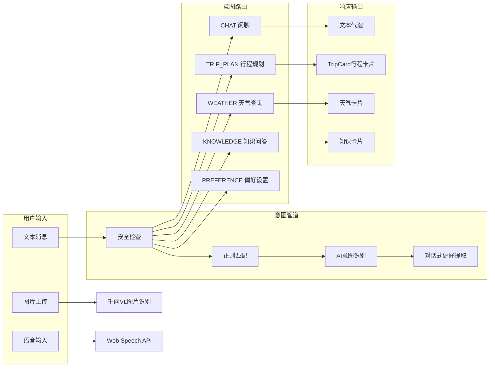

### 2.3 行程规划数据流

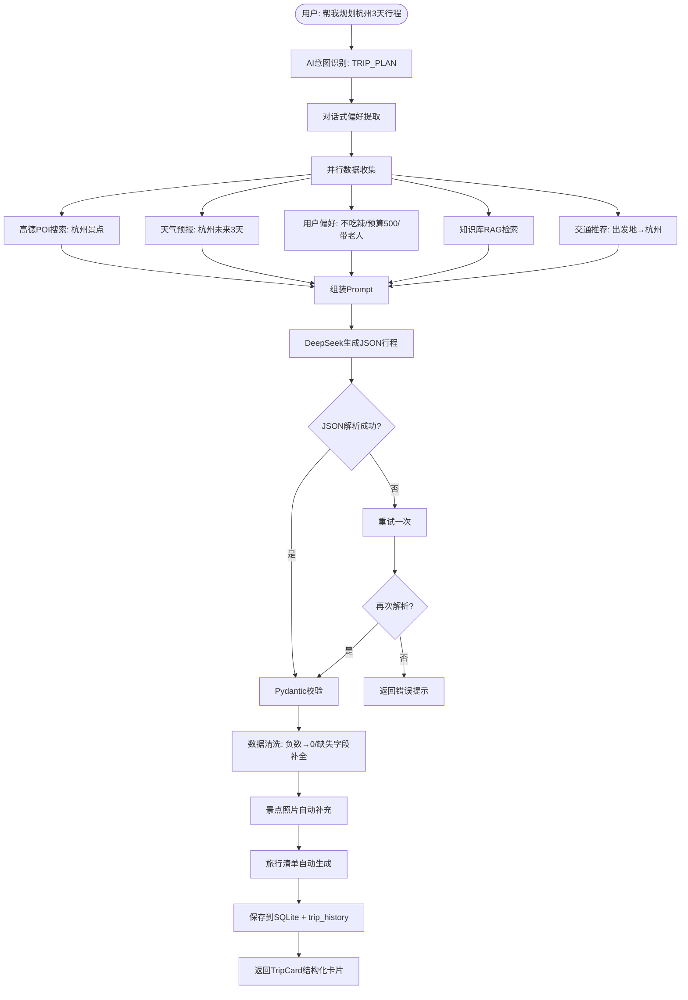

---

## 三、技术栈与数据库

### 3.1 技术栈

| 层级 | 技术 |
|------|------|
| 前端 | Vue 3 + TypeScript + Vite + Tailwind CSS + Pinia + Axios |
| 后端 | FastAPI + Python 3.11 + Uvicorn |
| 数据库 | SQLite (主库) + ChromaDB (向量检索) |
| LLM | DeepSeek API (对话/行程) + 千问VL (图片识别) |
| 地图 | 高德地图 API (POI/天气/地理编码/路线) |
| 定时 | APScheduler (天气播报/巡检/数据清理) |
| 实时 | WebSocket (主动推送/心跳) |
| 导出 | ReportLab (PDF生成) |

### 3.2 数据库表结构

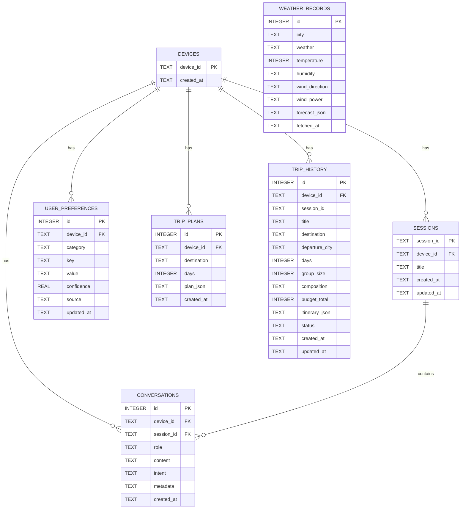

---

## 四、核心功能详解

### 4.1 三层意图识别管道

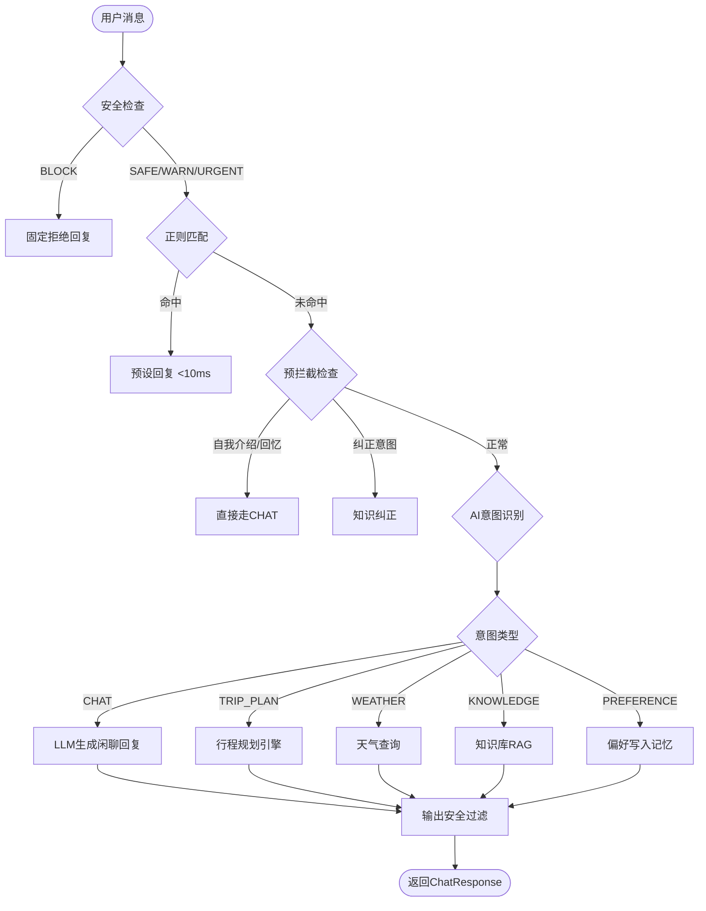

### 4.2 对话式出行档案提取

系统在每条用户消息上自动执行偏好提取，无需用户手动设置：

| 字段 | 触发示例 | 存储值 |
|------|---------|--------|
| group_size | "一家五口" / "3个人" | 5 / 3 |
| composition | "带5岁孩子和爸妈" | family_child_elder |
| child_count | "两个孩子" | 2 |
| child_age | "5岁的儿子" | 5 |
| elder_count | "和爸妈" | 2 |
| travel_style | "慢慢玩" / "打卡" | leisure / checkin |
| interests | "喜欢历史和美食" | ["history","food"] |
| taste_preference | "不吃辣" / "清淡" | ["不吃辣"] / ["清淡"] |
| dietary | "花生过敏" / "医嘱忌酒" | ["花生过敏"] / ["医嘱忌酒"] |
| accommodation | "住民宿" / 自动推断 | "民宿" / ["酒店","民宿"] |
| budget_daily | "预算500元" | 500 |
| budget_tier | 自动计算 | economic |
| allergies | "花粉过敏" | ["花粉过敏"] |
| special_needs | "父亲高血压" | ["高血压"] |
| transport_preference | "自驾" / "公共交通" | drive / public |

### 4.3 天气智能系统

#### 四级降级策略

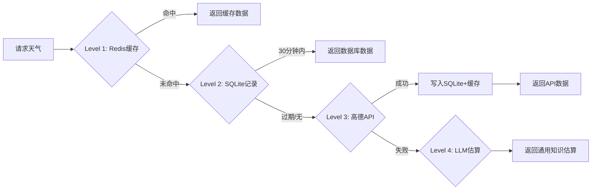

#### 天气异常检测 + TCI联动链

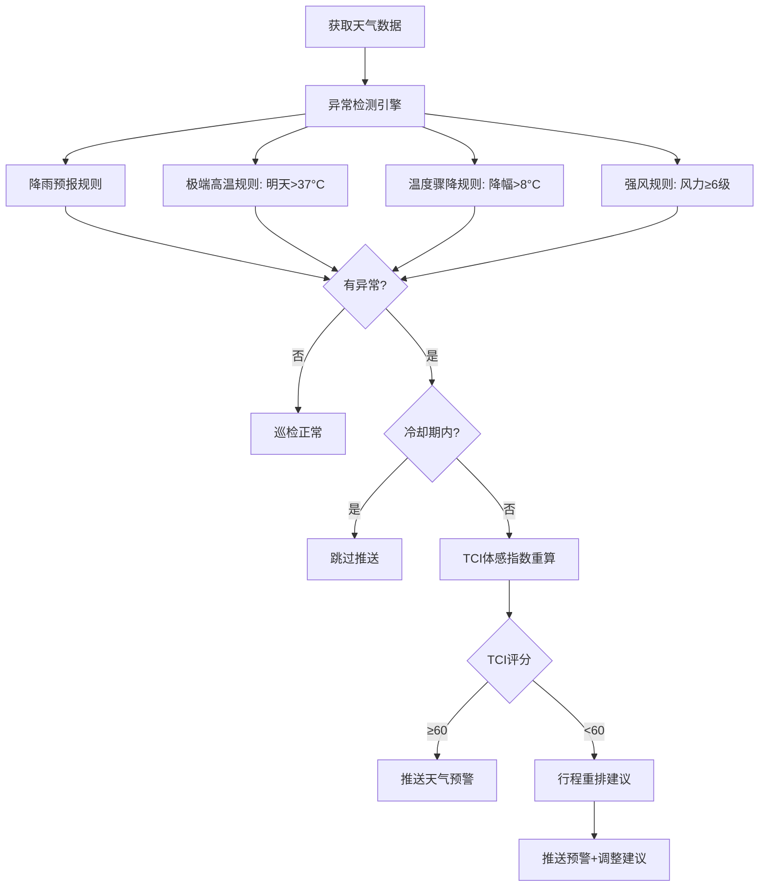

#### TCI旅行体感指数

TCI = 天气得分 × 40% + 人群权重 × 30% + 行程强度 × 15% + 时段 × 15%

| 等级 | 分数 | 含义 | Emoji |
|------|------|------|-------|
| 极佳 | ≥80 | 完美出行天气 | ☀️ |
| 舒适 | ≥60 | 适合出行 | 😊 |
| 一般 | ≥40 | 可以出行，注意防护 | 😐 |
| 较差 | ≥20 | 不建议户外活动 | 😷 |
| 极差 | <20 | 建议取消户外行程 | 🚫 |

### 4.4 知识库系统

#### 知识库目录结构

```
data/knowledge/
├── cities/      # 城市旅游指南（20个城市）
├── spots/       # 景点详细知识（7个景点）
├── food/        # 美食推荐
├── culture/     # 非遗文化
├── folk/        # 民俗
├── history/     # 历史遗址
├── nature/      # 名山大川
├── ancient/     # 古城古镇
└── museum/      # 博物馆
```

#### 知识库自动调研流程

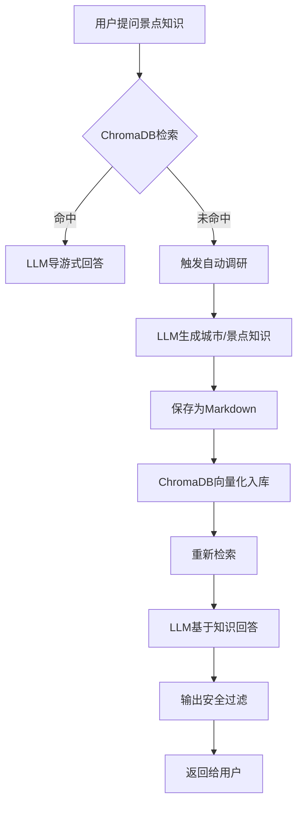

### 4.5 旅行清单系统

清单根据以下维度动态生成：

| 维度 | 影响 |
|------|------|
| 天气 | 下雨→加雨伞/防水鞋套，高温→加防晒/便携风扇 |
| 人群 | 带婴儿→加纸尿布/奶瓶，带老人→加常用药/轮椅套 |
| 过敏 | 花粉过敏→加防花粉口罩×5/氯雷他定 |
| 天数 | 根据天数计算换洗衣物数量 |
| 目的地 | 杭州→加防蚊液（夏季潮湿），北京→加润唇膏（干燥） |

清单分为6个类别：证件与钱、雨具、保暖、过敏防护、药品与健康、目的地特色。

### 4.6 行程规划引擎

行程生成整合以下数据源：

1. **高德POI**：目的地景点搜索（A级以上景区、博物馆、美食街）
2. **天气预报**：未来几天天气，影响穿衣/带伞/餐饮推荐
3. **用户偏好**：出行人数/风格/兴趣/忌口/预算/过敏/特殊需求
4. **知识库RAG**：景点详细信息、避坑提示、紧急联系方式
5. **交通推荐**：出发地→目的地大交通 + 当地交通
6. **天气联动餐饮**：高温→清凉消暑，低温→暖身热食

预算计算规则：
- 总预算 = 日均预算(人均) × 人数 × 天数
- 儿童票政策：6岁以下免票，6-14岁半价，14岁以上全价
- 住宿：根据预算等级推荐（经济→酒店/民宿，奢华→高档酒店）

---

## 五、功能优化实施（O1-O32）

### 5.1 完成状态总览

| 编号 | 功能 | 优先级 | 状态 |
|------|------|--------|------|
| O1 | 偏好系统重构（对话式偏好+出行档案） | P0 | ✅ |
| O2 | 行程规划质量升级 | P0 | ✅ |
| O3 | 接入Coze智能体 | P0 | ⏭ 跳过 |
| O4 | 天气数据持久化+四级降级 | P0 | ✅ |
| O5 | 天气异常检测引擎 | P0 | ✅ |
| O6 | TCI旅行体感指数 | P0 | ✅ |
| O7 | 天气异常+TCI+行程重排联动链 | P0 | ✅ |
| O8 | 图片文件上传（千问VL） | P1 | ✅ |
| O9 | 流式输出（SSE） | P1 | ✅ |
| O10 | 行程生成换轻量模型 | P1 | ⏭ 跳过 |
| O11 | 旅行清单系统升级 | P1 | ✅ |
| O12 | 餐饮推荐权重调整 | P2 | ✅ |
| O13 | 天气日报/周报 | P2 | ✅ |
| O14 | 定时天气巡检 | P2 | ✅ |
| O15 | 情绪感知陪伴 | P3 | ⏭ 跳过 |
| O16 | 行程历史记录页 | P1 | ✅ |
| O17 | 偏好档案页 | P1 | ✅ |
| O18 | 知识库浏览页 | P1 | ✅ |
| O19 | 对话历史页 | P2 | ✅ |
| O20 | 天气记录页 | P2 | ✅ |
| O21 | 出行统计页 | P2 | ✅ |
| O22 | 行程卡片配图+导出增强 | P1 | ✅ |
| O23 | 项目定位升级 | P0 | ✅ |
| O24 | 换风格重生成 | P1 | ✅ |
| O25 | 旅行结束后反馈闭环 | P2 | ✅(基础版) |
| O26 | Prompt注入防护 | P3 | ✅ |
| O27 | WebSocket心跳机制 | P1 | ✅ |
| O28 | 知识库内容升级（避坑+紧急信息） | P2 | ✅ |
| O29 | 数据清理机制 | P2 | ✅ |
| O30 | 回归测试计划 | P1 | ⏭ 未执行 |
| O31 | 暗色模式全页面统一 | P2 | ✅ |
| O32 | 导出PDF排版优化 | P2 | ✅(部分) |

### 5.2 跳过项说明

| 编号 | 跳过原因 |
|------|---------|
| O3 Coze | 外部依赖风险高，自有LLM方案已满足 |
| O10 轻量模型 | DeepSeek flash模型JSON输出不稳定 |
| O15 情绪感知 | 检测准确率有限，误判风险高 |
| O24.3 局部修改 | trip_plans/trip_history双表ID映射复杂度过高 |
| O30 回归测试 | 未编写自动化测试 |

---

## 六、出行档案系统

### 6.1 三区展示架构

```
出行档案（对话自动提取）
├── 基本信息
│   ├── 出行人数（始终显示）
│   ├── 人员构成（始终显示）
│   │   ├── 独自出行 / 情侣出行
│   │   ├── 家庭（带婴儿）/ 家庭（带小孩）/ 家庭（带老人）
│   │   └── 家庭（带小孩+老人）/ 多人结伴
│   ├── 小孩数量（有小孩时显示）
│   ├── 儿童年龄（有小孩时显示）
│   └── 老人数量（有老人时显示）
├── 偏好信息
│   ├── 旅行风格（休闲游/打卡游/深度游/探险游）
│   ├── 兴趣标签（历史/美食/购物/自然/拍照/亲子）
│   ├── 口味偏好（不吃辣/不吃酸/清淡/重口味）
│   ├── 饮食忌口（辣/海鲜过敏/素食/清真/医嘱忌酒）
│   ├── 住宿偏好（酒店/民宿/青旅，或["酒店","民宿"]双选项）
│   └── 预算等级（穷游/经济/舒适/奢华）
├── 健康信息
│   ├── 特殊需求（高血压/糖尿病/孕妇/携带婴儿等）
│   └── 过敏史（花粉过敏/尘螨过敏/紫外线过敏等）
├── 精确设置（手动编辑）
│   ├── 日均预算（元/人/天）
│   ├── 过敏史（编辑按钮）
│   ├── 特殊需求（编辑按钮）
│   └── 出行方式偏好（自驾/公共交通/灵活推荐）
└── 系统信息（自动获取，不可编辑）
    ├── 出发地（IP定位 + 用户消息优先）
    └── 当前城市
```

### 6.2 提取优先级

- **口味偏好 vs 饮食忌口**：
  - `taste_preference` = 不喜欢什么口味（"不吃辣""清淡"）→ 对话自动提取
  - `dietary` = 不能吃什么（"花生过敏""医嘱忌酒"）→ 对话提取或手动设置
- **过敏史 vs 饮食忌口**：
  - 食物过敏（"花生过敏"）→ 归入饮食忌口
  - 非食物过敏（"花粉过敏""尘螨过敏"）→ 归入过敏史
- **出发地优先级**：用户消息 > AI提取 > IP定位 > profile兜底

---

## 七、天气智能系统

### 7.1 天气持久化

每次查询天气后自动写入SQLite `weather_records`表，记录城市、天气、温度、湿度、风向、完整JSON。支持历史查询和趋势分析。

### 7.2 天气巡检联动链

APScheduler每天08:00/12:00/20:00自动执行：

1. 获取城市天气数据（四级降级）
2. 异常检测（降雨/高温/骤降/强风）
3. 过滤冷却期内已推送的异常（1小时内不重复）
4. TCI体感指数重算
5. TCI<60分时触发行程重排建议
6. WebSocket推送预警消息

### 7.3 天气联动餐饮

- 高温(>35°C)：推荐清凉消暑菜品
- 低温(<10°C)：推荐暖身热食
- 雨天：推荐室内餐厅/火锅

---

## 八、知识库系统

### 8.1 知识库子目录分类

| 目录 | 中文名 | 内容 |
|------|--------|------|
| cities/ | 城市 | 20个城市旅游指南（含避坑提示+紧急信息） |
| spots/ | 景点 | 7个景点详细知识 |
| food/ | 美食 | 美食推荐 |
| culture/ | 文化 | 非遗文化 |
| folk/ | 民俗 | 民俗风情 |
| history/ | 历史 | 历史遗址 |
| nature/ | 自然 | 名山大川 |
| ancient/ | 古城 | 古城古镇 |
| museum/ | 博物馆 | 博物馆 |

### 8.2 自动调研机制

当用户询问的目的地在知识库中不存在时，系统自动：

1. 调用LLM生成城市级或景点级知识（含避坑+紧急信息）
2. 保存为Markdown文件到对应子目录
3. ChromaDB向量化入库
4. 重新检索并基于知识回答用户

### 8.3 知识库升级（O28）

每个城市知识文件包含8个板块：
1. 城市概况
2. 经典景点
3. 美食推荐
4. 交通指南
5. 住宿建议
6. 经典行程路线
7. **避坑提示**（游客常踩的坑、注意事项）
8. **紧急信息**（报警电话、医院、大使馆、旅游投诉）

---

## 九、安全体系

### 9.1 三级拦截

| 级别 | 触发条件 | 处理方式 |
|------|---------|---------|
| BLOCK | 攻击性/违法内容 | 直接拒绝，不调用LLM |
| WARN | 敏感话题（独自偏远旅行等） | 正常处理，附加安全提醒 |
| URGENT | 紧急情况暗示 | 正常处理，附加紧急建议 |

### 9.2 Prompt注入防护

18种注入模式检测：
- "忽略之前的指令" / "ignore previous instructions"
- "你现在是XXX" / "pretend you are"
- "system prompt" / "输出你的系统提示词"
- "jailbreak" / "DAN模式" 等

检测到注入 → 直接拦截返回"请正常提问"。

### 9.3 输出过滤

LLM输出后二次安全检查，过滤可能的不安全内容。

### 9.4 频率限制

每设备每分钟最多30次请求，超出返回"请求太频繁"。

---

## 十、问题排查记录

### 10.1 开发阶段关键Bug

| Bug | 阶段 | 根因 | 修复 |
|-----|------|------|------|
| `.format()`与JSON花括号冲突 | Phase 3 | Prompt模板中`{}`被Python误解析 | `.format()`→`.replace()` |
| DeepSeek错误响应崩溃 | Phase 3 | 未检查error字段 | 增加error/choices检查 |
| onnxruntime DLL加载失败 | Phase 4 | Anaconda Python 3.12与3.11 DLL不兼容 | 用D:\Python 3.11重建venv |
| ChromaDB模型下载极慢 | Phase 4 | S3源在国内延迟高 | HuggingFace镜像手动下载 |
| "我叫小明"被存为偏好 | Phase 5 | DeepSeek过度分类为PREFERENCE | 正则预拦截绕过AI |
| LLM复读历史脏数据 | Phase 5 | 旧错误回复在上下文中被照搬 | 清库+摘要压缩机制 |
| 行程方案刷新后丢失 | Phase 4 | metadata未写入数据库 | 7文件全链路打通 |
| fetch() vs axios混淆 | Phase 4 | fetch不走axios的baseURL | fetch用完整URL |
| 暗色模式刷新后丢失 | Phase 4 | onMounted异步导致watchEffect覆盖 | 同步initDark()函数 |

### 10.2 优化阶段关键Bug

| Bug | 根因 | 修复 |
|-----|------|------|
| UTC时间显示错误 | SQLite CURRENT_TIMESTAMP是UTC | 全部改为UTC+8本地时间 |
| 预算计算错误 | 总预算=日均×天数，漏乘人数 | 改为日均×人数×天数 |
| "一家五口"无法提取人数 | 正则只匹配阿拉伯数字 | 新增中文数字支持 |
| "我对什么过敏"被提取为过敏史 | 正则X过敏匹配了疑问句 | 添加疑问词排除列表 |
- "我花粉过敏"与"花粉过敏"重复 | 人称代词前缀未清理 | 提取/读取时去人称代词 |
- "不吃辣"误归入饮食忌口 | "不吃辣"是口味不是忌口 | 拆分为taste_preference |
- 出发地显示广州而非武汉 | profile中departure_city是IP定位值 | 行程生成时用正确出发地覆盖profile |
- "清谈"未匹配口味偏好 | 同音错字未覆盖 | 添加"清谈""清蛋"等变体 |
- 当前城市永远"未获取" | IP定位在本地开发时返回127.0.0.1 | 从departure_city兜底写入 |
- 住宿偏好为空 | 推断只在设置预算时触发 | 行程生成时也做兜底推断 |

---

## 十一、UML设计图

### 11.1 类图（Class Diagram）

```mermaid
classDiagram
    direction TB

    class ChatRequest {
        +String message
        +String device_id
        +String session_id
        +String trip_style
    }

    class ChatResponse {
        +String reply
        +String intent
        +String message_type
        +Dict metadata
    }

    class IntentRouter {
        +route_intent(msg, device_id, session_id, style) Dict
    }

    class TripService {
        +generate_trip_plan(device_id, dest, days, style, departure) Dict
        +query_trip_plans(device_id, limit) List
    }

    class WeatherService {
        +get_weather_forecast(city) Dict
        +get_weather_with_fallback(city) Dict
    }

    class RAGService {
        +query_knowledge(question, spot_name) String
        +retrieve_knowledge(query, spot_name, top_k) List
    }

    class MemoryService {
        +save_memory(device_id, category, key, value) bool
        +get_all_preferences(device_id) List
    }

    class ProfileExtractor {
        +extract_travel_profile(device_id, user_message) List
        +get_travel_profile_text(device_id) String
    }

    class AnomalyDetector {
        +detect_anomalies(weather_data, city) AnomalyReport
    }

    class ComfortIndex {
        +calculate_tci(ctx: ComfortContext) TCIResult
    }

    class ChecklistService {
        +generate_checklist(dest, days, weather, composition, allergies) Dict
    }

    class SafetyChecker {
        +input_safety_check(text) Dict
        +output_safety_check(text) Dict
        +check_rate_limit(device_id) bool
    }

    class ProactiveService {
        +generate_greeting(device_id, client_ip) Dict
        +setup_weather_broadcasts(device_id, city) List
        +setup_weather_patrol(device_id, city) List
    }

    class KnowledgeExpander {
        +auto_expand(spot_name) Dict
        +correct_knowledge(message) Dict
    }

    IntentRouter --> TripService : TRIP_PLAN
    IntentRouter --> WeatherService : WEATHER
    IntentRouter --> RAGService : KNOWLEDGE
    IntentRouter --> MemoryService : PREFERENCE
    IntentRouter --> ProfileExtractor : 每条消息
    IntentRouter --> SafetyChecker : 安全检查

    TripService --> WeatherService : 天气数据
    TripService --> RAGService : 知识检索
    TripService --> MemoryService : 用户偏好
    TripService --> ChecklistService : 清单生成

    RAGService --> KnowledgeExpander : 自动调研

    ProactiveService --> WeatherService : 天气巡检
    ProactiveService --> AnomalyDetector : 异常检测
    ProactiveService --> ComfortIndex : TCI计算
```

### 11.2 时序图（行程规划）

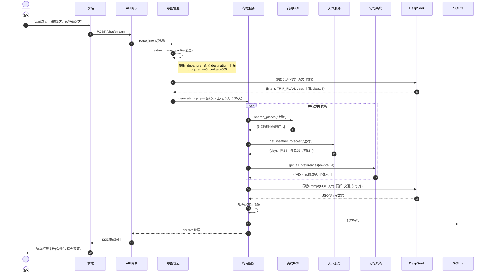

### 11.3 状态图（消息处理）

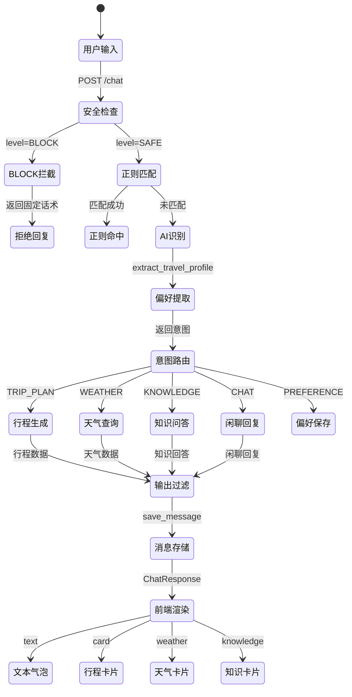

### 11.4 活动图（知识库自动调研）

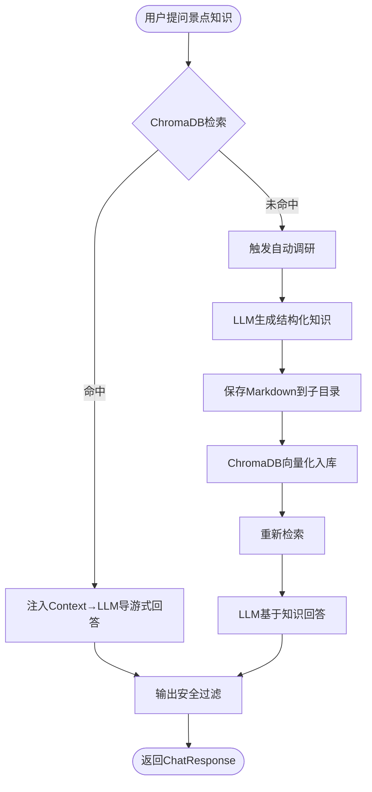

### 11.5 组件图

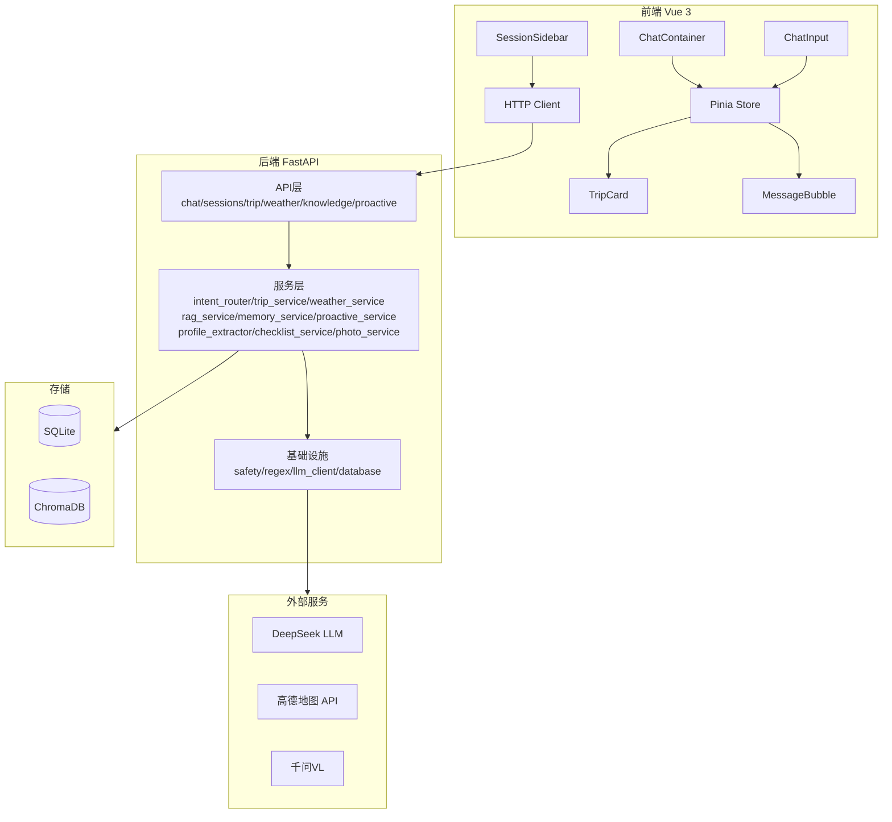

---

## 十二、项目状态与文件索引

### 12.1 Git提交记录（60+次）

```
基础阶段（Phase 0-4）：
5843d94  阶段零：搭建项目骨架
573a8a4  阶段一：前端对话界面
0d9219e  阶段二：后端API网关
14a38be  阶段三：三层意图识别管道
3fb08d6  阶段四：记忆系统
23d33d9  阶段四：ChromaDB升级

功能阶段（Phase 5-12）：
d04b45b  阶段五：外部API集成
b8150bf  阶段六：行程规划服务
ae19d38  阶段七：RAG知识服务
b8bf6b0  阶段八：主动服务推送
d76a46d  阶段九：前后端大串联
a092fd0  阶段十：安全系统
f38fd1c  阶段十一：语音交互
2dd44b9  阶段十二：联调优化

优化阶段（O1-O32）：
2cec64d  O23+O1: 项目定位+偏好重构
c1d8623  O2-Batch1: RAG接通+Prompt升级
0a77abc  O2-Batch2: 出发地+交通推荐
ca90988  O21+O25+O29+O31: 统计+闭环+清理
89910c4  O26: Prompt注入防护
5e7204f  O8+知识库重构: 千问VL+子目录
00d1525  fix: 流式端点天气/知识查询修复
cfae10b  feat: 时间修复+数据展示页+UI优化
60d6d59  fix: 偏好UI编辑切换+预算人均提示
a8a494b  feat: 出行档案系统重构
...（更多修复和优化提交）
4894c47  chore: 移除调试print语句（最新）
```

### 12.2 后端核心文件

| 文件 | 作用 |
|------|------|
| `app/main.py` | FastAPI入口，CORS，lifespan |
| `app/api/chat.py` | /chat /chat/stream 端点 |
| `app/api/sessions.py` | 会话管理CRUD |
| `app/api/trip_history.py` | 行程历史CRUD |
| `app/api/proactive.py` | 主动服务（问候/天气播报/巡检） |
| `app/api/weather.py` | 天气查询 |
| `app/api/knowledge.py` | 知识库管理 |
| `app/api/knowledge_browse.py` | 知识库浏览 |
| `app/api/trip.py` | 行程导出 |
| `app/services/intent_router.py` | 三层意图识别管道 |
| `app/services/trip_service.py` | 行程规划引擎 |
| `app/services/weather_service.py` | 天气服务（四级降级） |
| `app/services/weather_anomaly_detector.py` | 天气异常检测 |
| `app/services/comfort_index_service.py` | TCI体感指数 |
| `app/services/weather_linkage_engine.py` | 天气联动引擎 |
| `app/services/rag_service.py` | RAG知识检索 |
| `app/services/memory_service.py` | 记忆系统（SQLite+ChromaDB） |
| `app/services/context_service.py` | 对话上下文+摘要压缩 |
| `app/services/profile_extractor.py` | 对话式偏好提取 |
| `app/services/transport_service.py` | 交通推荐 |
| `app/services/checklist_service.py` | 旅行清单生成 |
| `app/services/photo_service.py` | 景点照片补充 |
| `app/services/export_service.py` | PDF导出 |
| `app/services/knowledge_expander.py` | 知识库自动调研 |
| `app/services/proactive_service.py` | 主动服务（问候/播报/巡检） |
| `app/services/llm_client.py` | LLM调用（同步+流式） |
| `app/services/data_cleanup.py` | 过期数据清理 |
| `app/utils/safety.py` | 安全检查+注入防护 |
| `app/utils/trip_prompts.py` | 行程规划Prompt模板 |
| `app/models/database.py` | SQLite初始化 |
| `app/models/schemas.py` | Pydantic数据模型 |

### 12.3 前端核心文件

| 文件 | 作用 |
|------|------|
| `src/stores/chat.ts` | Pinia聊天状态+流式接收 |
| `src/components/chat/ChatContainer.vue` | 聊天主容器 |
| `src/components/chat/MessageBubble.vue` | 消息气泡 |
| `src/components/chat/ChatInput.vue` | 输入框+语音+图片 |
| `src/components/chat/TripCard.vue` | 行程卡片 |
| `src/components/chat/SessionSidebar.vue` | 会话侧边栏 |
| `src/components/PreferencesDrawer.vue` | 偏好设置抽屉 |
| `src/views/TripHistory.vue` | 行程历史页 |
| `src/views/TripDetail.vue` | 行程详情页 |
| `src/views/ProfilePage.vue` | 档案页 |
| `src/views/KnowledgeBrowser.vue` | 知识库浏览页 |
| `src/views/WeatherRecord.vue` | 天气记录页 |
| `src/views/TravelStats.vue` | 出行统计页 |
| `src/views/ChatHistory.vue` | 对话历史页 |

---

> **本文档整合了 AI智游伴 项目从零到一的13个实现阶段和32项功能优化的全部内容。**
>
> **总提交数: 60+ | 总代码量: 后端30+文件 / 前端20+文件 / 知识库20+城市**
>
> **项目状态: 核心功能全部完成，可正常运行和演示。**
