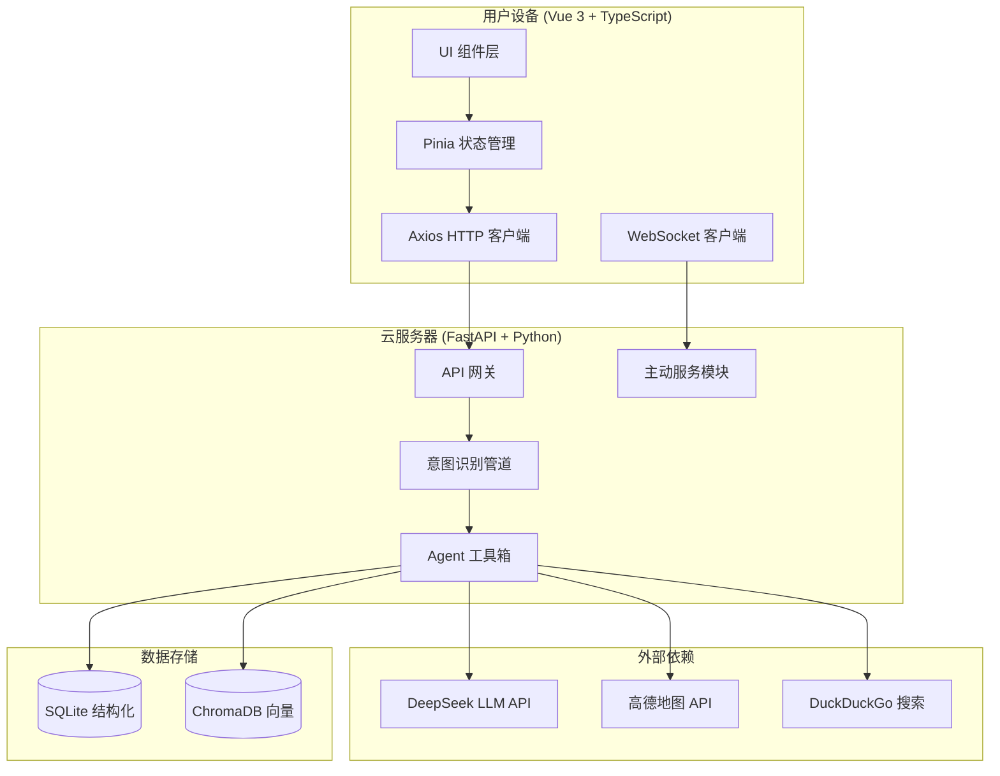
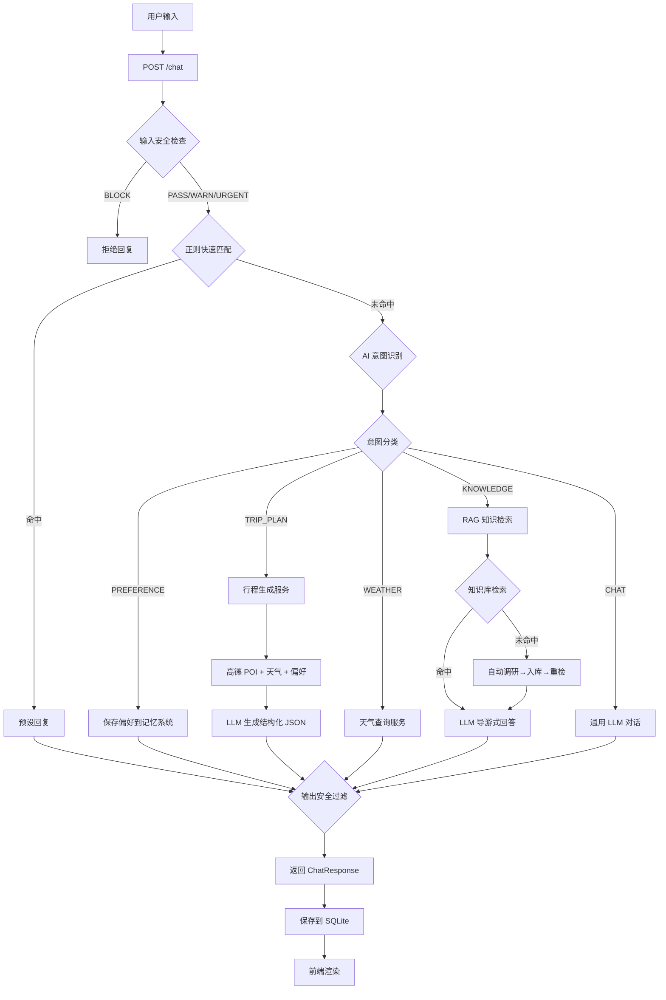

# AI智游伴 (TravelMate) 项目书

> **项目名称**：AI智游伴 (TravelMate) — 智能旅行对话助手
> **文档版本**：v1.0（整合版，合并完整实现方案与优化方案）
> **最后更新**：2026-05-13

---

## 目录

- [一、项目概述](#一项目概述)
- [二、系统架构](#二系统架构)
- [三、数据流与工作流程](#三数据流与工作流程)
- [四、基础实现：工程搭建与界面（阶段0-2）](#四基础实现工程搭建与界面阶段0-2)
- [五、核心智能层：意图识别与记忆系统（阶段3-4）](#五核心智能层意图识别与记忆系统阶段3-4)
- [六、外部集成与知识服务（阶段5-7）](#六外部集成与知识服务阶段5-7)
- [七、主动服务与安全体系（阶段8-10）](#七主动服务与安全体系阶段8-10)
- [八、增强功能与部署（阶段11-12）](#八增强功能与部署阶段11-12)
- [九、优化升级方案](#九优化升级方案)
- [十、附录](#十附录)

---

## 一、项目概述

### 1.1 项目定位

**AI智游伴 (TravelMate)** 是一款基于大语言模型的智能旅行对话助手，集行程规划、景点讲解、天气查询、偏好记忆于一体。用户通过自然语言对话即可获得个性化的旅行建议和完整的行程方案。

### 1.2 核心能力

| 能力 | 说明 |
|------|------|
| 行程规划 | 基于用户偏好、实时 POI、天气数据，LLM 生成结构化多日行程方案 |
| 景点知识 | RAG 知识检索 + LLM 导游式回答，支持自动调研扩充知识库 |
| 天气查询 | 实时天气预报与穿衣建议 |
| 偏好记忆 | 双引擎记忆系统（向量 + 结构化），记住用户饮食、预算、出行偏好 |
| 主动服务 | 定时天气提醒、到达景点问候、个性化开场白 |
| 安全防护 | 三级安全检查（拦截/警告/紧急），输入输出双向过滤 |
| 语音交互 | 语音识别 + TTS 播报景点知识 |

### 1.3 技术栈

| 层级 | 技术 | 说明 |
|------|------|------|
| **前端框架** | Vue 3 + TypeScript + Vite | 组合式 API，类型安全 |
| **状态管理** | Pinia | 响应式状态，支持热重载 |
| **样式** | Tailwind CSS v4 | CSS-first 配置，暗色模式支持 |
| **HTTP 客户端** | Axios | 统一拦截器，baseURL 配置 |
| **后端框架** | FastAPI | 异步高性能，自动 OpenAPI 文档 |
| **结构化存储** | SQLite | 会话、消息、偏好、行程数据 |
| **向量存储** | ChromaDB | 语义相似度搜索（用户偏好 + 知识库） |
| **LLM** | DeepSeek | 意图识别、行程生成、知识问答、问候生成 |
| **地图服务** | 高德地图 API | POI 搜索、地理编码、天气查询 |
| **知识搜索** | DuckDuckGo | 免费网络搜索，用于知识库自动调研 |
| **实时通信** | WebSocket | 主动消息推送 |
| **定时任务** | APScheduler | 轻量级异步定时任务 |
| **语音** | Web Speech API | 浏览器端语音识别 + TTS |

### 1.4 功能全景图

```
┌─────────────────────────────────────────────────────────────────────┐
│                        AI智游伴 功能全景                              │
├─────────────────────────────────────────────────────────────────────┤
│                                                                     │
│  ┌─────────────┐  ┌─────────────┐  ┌─────────────┐                │
│  │  行程规划    │  │  景点知识    │  │  天气查询    │                │
│  │  ·多日行程   │  │  ·RAG检索   │  │  ·实时预报   │                │
│  │  ·风格对比   │  │  ·自动调研   │  │  ·穿衣建议   │                │
│  │  ·预算估算   │  │  ·反馈纠正   │  │  ·出行提醒   │                │
│  │  ·准备清单   │  │  ·导游问答   │  │  ·首页天气   │                │
│  └──────┬──────┘  └──────┬──────┘  └──────┬──────┘                │
│         │                │                │                         │
│  ┌──────┴────────────────┴────────────────┴──────┐                │
│  │              三级意图识别管道                     │                │
│  │  正则匹配 → AI 意图识别 → 安全检查               │                │
│  └──────┬────────────────┬────────────────┬──────┘                │
│         │                │                │                         │
│  ┌──────┴──────┐  ┌──────┴──────┐  ┌──────┴──────┐                │
│  │  偏好记忆    │  │  会话管理    │  │  主动服务    │                │
│  │  ·双引擎    │  │  ·多会话     │  │  ·天气提醒   │                │
│  │  ·语义搜索  │  │  ·自动命名   │  │  ·智能问候   │                │
│  │  ·上下文注入│  │  ·重命名     │  │  ·到达欢迎   │                │
│  └─────────────┘  └─────────────┘  └─────────────┘                │
│                                                                     │
│  ┌─────────────┐  ┌─────────────┐  ┌─────────────┐                │
│  │  安全防护    │  │  语音交互    │  │  界面美化    │                │
│  │  ·三级检查   │  │  ·语音识别   │  │  ·暗色模式   │                │
│  │  ·输入过滤   │  │  ·TTS播报   │  │  ·暖色主题   │                │
│  │  ·输出过滤   │  │  ·普通话     │  │  ·微动画     │                │
│  └─────────────┘  └─────────────┘  └─────────────┘                │
└─────────────────────────────────────────────────────────────────────┘
```

---

## 二、系统架构

### 2.1 四大系统组件



### 2.2 目录结构

```
travelmate/
├── backend/
│   ├── app/
│   │   ├── main.py              # FastAPI 应用入口 + 启动时间戳
│   │   ├── config.py            # pydantic-settings 配置管理
│   │   ├── api/
│   │   │   ├── chat.py          # POST /chat 核心端点
│   │   │   ├── sessions.py      # 会话 CRUD API
│   │   │   ├── memory.py        # 偏好管理 API
│   │   │   ├── weather.py       # 天气查询 API
│   │   │   ├── knowledge.py     # 知识库管理 API（自动调研/批量扩充）
│   │   │   ├── proactive.py     # 主动问候 API
│   │   │   └── trip.py          # 行程导出 API
│   │   ├── services/
│   │   │   ├── intent_router.py      # 三级意图识别管道
│   │   │   ├── memory_service.py     # Hermes 记忆系统
│   │   │   ├── context_service.py    # 对话上下文管理
│   │   │   ├── trip_service.py       # 行程生成服务
│   │   │   ├── rag_service.py        # RAG 知识检索服务
│   │   │   ├── knowledge_expander.py # 知识库自动调研管线
│   │   │   ├── weather_service.py    # 天气查询服务
│   │   │   ├── map_service.py        # 高德地图服务
│   │   │   ├── proactive_service.py  # 主动服务逻辑
│   │   │   ├── export_service.py     # 行程导出服务
│   │   │   ├── llm_client.py         # DeepSeek API 封装
│   │   │   └── checklist_service.py  # 旅行准备清单
│   │   ├── models/
│   │   │   ├── database.py     # SQLite 连接 + 表创建 + 迁移
│   │   │   └── schemas.py      # Pydantic 数据模型
│   │   ├── utils/
│   │   │   ├── safety.py       # 安全检查（输入/输出/限流）
│   │   │   ├── trip_prompts.py # 行程生成 Prompt 模板
│   │   │   └── device.py       # 设备 ID 工具
│   │   └── tools/
│   │       └── tool_registry.py # 工具注册中心
│   ├── db/                     # SQLite + ChromaDB 数据目录
│   │   ├── travelmate.db
│   │   ├── chroma_memory/      # 用户偏好向量库
│   │   └── chroma_knowledge/   # 景点知识向量库
│   ├── data/knowledge/         # 景点知识 Markdown 文档
│   ├── requirements.txt
│   └── .env                    # API Keys（不入 Git）
│
├── frontend/
│   ├── src/
│   │   ├── main.ts
│   │   ├── App.vue             # 暗色模式管理 + 后端重启检测
│   │   ├── style.css           # Tailwind v4 + 暗色模式变体
│   │   ├── api/
│   │   │   └── client.ts       # Axios 实例 + 拦截器
│   │   ├── stores/
│   │   │   └── chat.ts         # Pinia 聊天状态管理
│   │   ├── components/
│   │   │   ├── chat/
│   │   │   │   ├── ChatContainer.vue   # 主布局（侧边栏+消息区）
│   │   │   │   ├── ChatInput.vue       # 输入框 + 风格选择器
│   │   │   │   ├── MessageBubble.vue   # 消息气泡 + Markdown
│   │   │   │   ├── TripCard.vue        # 结构化行程卡片
│   │   │   │   ├── SessionSidebar.vue  # 会话侧边栏
│   │   │   │   ├── StyleSelector.vue   # 行程风格选择器
│   │   │   │   ├── PreferencePanel.vue # 偏好管理面板
│   │   │   │   ├── BatchExpandModal.vue# 知识库批量扩充
│   │   │   │   └── WelcomePage.vue     # 欢迎页
│   │   │   └── common/
│   │   │       └── icons/
│   │   ├── composables/
│   │   │   ├── useWebSocket.ts    # WebSocket 连接管理
│   │   │   ├── useSpeechRecognition.ts # 语音识别
│   │   │   └── useSpeechSynthesis.ts   # TTS 播报
│   │   ├── utils/
│   │   │   ├── device.ts      # 设备 ID 生成
│   │   │   └── format.ts      # 时间格式化
│   │   └── types/
│   │       └── index.ts       # 全局 TypeScript 类型
│   ├── index.html
│   ├── vite.config.ts
│   ├── tsconfig.json
│   ├── tailwind.config.js
│   └── package.json
│
├── docs/                        # 项目文档
│   ├── AI智游伴项目书.md         # 本文档
│   ├── optimization-plan.md     # 优化方案（详细实施）
│   └── project-progress.md      # 开发进度记录
│
└── README.md
```

### 2.3 核心数据结构

#### 2.3.1 前端消息模型

```typescript
interface Message {
  id: string
  role: 'user' | 'assistant' | 'system'
  content: string
  timestamp: number
  type: 'text' | 'card' | 'weather' | 'knowledge' | 'proactive'
  metadata?: {
    trip_plan?: Itinerary      // 结构化行程数据
    trip_style?: string        // compact/leisure/culture
    destination?: string
    days?: number
    safety_warning?: string
    layer?: string             // regex/ai
    sub_intent?: string
    confidence?: number
    proactive_type?: string    // greeting
    quick_actions?: QuickAction[]
  }
}
```

#### 2.3.2 后端 Pydantic 模型

```python
class ChatRequest(BaseModel):
    message: str                  # 用户输入
    device_id: str                # 设备唯一标识
    session_id: str | None        # 会话 ID
    trip_style: str | None        # 行程风格

class ChatResponse(BaseModel):
    reply: str                    # AI 回复文本
    intent: str                   # 识别到的意图
    message_type: str             # 展示类型：text/card/weather/knowledge
    metadata: dict | None         # 附加数据（行程、安全等）

class Itinerary(BaseModel):
    trip_id: str
    destination: str
    summary: str
    days: list[DayPlan]
    estimated_budget: int
    budget_breakdown: BudgetBreakdown
    tips: list[str]
    food_summary: str
    transport_summary: str
    accommodation_summary: str

class DayPlan(BaseModel):
    day_index: int
    theme: str
    spots: list[SpotItem]
    meals: list[MealItem]
    transport: list[TransportItem]
    hotel: HotelItem | None
```

#### 2.3.3 数据库 Schema（SQLite）

```sql
-- 设备表
CREATE TABLE devices (
    device_id TEXT PRIMARY KEY,
    created_at TIMESTAMP DEFAULT CURRENT_TIMESTAMP
);

-- 会话表
CREATE TABLE sessions (
    id INTEGER PRIMARY KEY AUTOINCREMENT,
    session_id TEXT NOT NULL,
    device_id TEXT NOT NULL,
    title TEXT DEFAULT '新会话',
    created_at TIMESTAMP DEFAULT CURRENT_TIMESTAMP,
    updated_at TIMESTAMP DEFAULT CURRENT_TIMESTAMP
);

-- 对话消息表
CREATE TABLE conversations (
    id INTEGER PRIMARY KEY AUTOINCREMENT,
    device_id TEXT NOT NULL,
    session_id TEXT NOT NULL,
    role TEXT NOT NULL,              -- user/assistant/system
    content TEXT NOT NULL,
    intent TEXT,                     -- 识别到的意图分类
    metadata TEXT,                   -- JSON 附加数据（行程/天气等）
    created_at TIMESTAMP DEFAULT CURRENT_TIMESTAMP
);

-- 用户偏好表
CREATE TABLE user_preferences (
    id INTEGER PRIMARY KEY AUTOINCREMENT,
    device_id TEXT NOT NULL,
    category TEXT NOT NULL,          -- 饮食/出行/住宿/通用
    key TEXT NOT NULL,
    value TEXT NOT NULL,
    confidence REAL DEFAULT 0.8,     -- 置信度
    source TEXT DEFAULT 'explicit',  -- explicit/inferred
    updated_at TIMESTAMP DEFAULT CURRENT_TIMESTAMP
);

-- 行程规划表
CREATE TABLE trip_plans (
    id INTEGER PRIMARY KEY AUTOINCREMENT,
    device_id TEXT NOT NULL,
    destination TEXT NOT NULL,
    days INTEGER,
    plan_json TEXT,                  -- 完整 Itinerary JSON
    created_at TIMESTAMP DEFAULT CURRENT_TIMESTAMP
);
```

---

## 三、数据流与工作流程

### 3.1 完整数据流



### 3.2 三级意图识别管道

意图识别是系统的核心智能层，采用**正则 + AI + 安全**三层管道设计：

```
用户消息
  ↓
【第一层：正则快速匹配】<10ms
  ├── 问候语（你好/嗨/早上好）
  ├── 告别语（再见/拜拜）
  ├── 感谢语（谢谢/感谢）
  ├── 确认语（好的/可以/没问题）
  └── 50 字限制，超长直接跳过 AI
  ↓
【第二层：AI 意图识别】~300ms
  ├── 注入最近 6 条对话历史（上下文感知）
  ├── 注入用户历史偏好（个性化参考）
  ├── 输出结构化 JSON：
  │   intent / sub_intent / confidence / reasoning / extracted_data
  └── 意图优先级：
      PREFERENCE > 上下文延续 > TRIP_PLAN > WEATHER > KNOWLEDGE > CHAT
  ↓
【第三层：安全检查】
  ├── BLOCK（拦截）：非法活动关键词
  ├── WARN（警告）：高风险场景
  ├── URGENT（紧急）：医疗紧急情况
  └── 输出过滤：确保 AI 不鼓励危险行为
  ↓
返回意图 + 回复 + 安全等级
```

**意图分类体系**：

| 意图类别 | 代码 | 子意图 | 说明 |
|----------|------|--------|------|
| 行程规划 | TRIP_PLAN | trip_create / trip_modify / trip_query | 创建、修改或查询旅行计划 |
| 天气查询 | WEATHER | weather_current / weather_forecast | 查询当前天气或未来天气 |
| 偏好记录 | PREFERENCE | pref_set / pref_query | 用户设置或查询个人偏好 |
| 景点知识 | KNOWLEDGE | spot_intro / spot_nearby / spot_history | 景点介绍、周边查询、历史故事 |
| 闲聊问答 | CHAT | chat_general / chat_travel_tips | 普通对话、旅行小贴士 |

### 3.3 上下文延续机制

意图识别会注入最近 6 条对话历史，确保上下文连续性：

```
用户：查询杭州的天气
助手：杭州今天晴，28°C...
用户：哈尔滨                    ← 无"天气"关键词，但上轮在问天气
  ↓ AI 识别到上下文延续 → WEATHER
助手：哈尔滨今天多云，15°C...   ✅ 正确延续天气意图
```

```
用户：帮我规划去杭州的旅行
助手：好的！你想去杭州玩几天？
用户：三天                      ← 无"杭州"，但上轮在规划杭州
  ↓ AI 识别到上下文延续 → TRIP_PLAN
助手：好的，杭州3日游方案已生成 ✅ 正确延续行程意图
```

---

## 四、基础实现：工程搭建与界面（阶段0-2）

### 4.1 阶段零：工程脚手架搭建与基础设施

#### 4.1.1 前端初始化

```bash
# Vue 3 + Vite + TypeScript
npm create vite@latest frontend -- --template vue-ts
cd frontend
npm install pinia axios markdown-it tailwindcss
npm install -D @types/markdown-it @tailwindcss/vite
```

**核心配置**：

- **Vite**：开发服务器端口 5173，代理 `/api` 到后端 8000
- **Tailwind CSS v4**：CSS-first 配置，通过 `@import "tailwindcss"` 和 `@variant dark` 实现暗色模式
- **TypeScript**：严格模式，路径别名 `@/` 指向 `src/`

#### 4.1.2 后端初始化

```bash
# FastAPI + Python
python -m venv venv
pip install fastapi uvicorn pydantic-settings httpx aiofiles
```

**核心配置**：

- **pydantic-settings**：从 `.env` 文件读取 API Keys（`DEEPSEEK_API_KEY`、`AMAP_API_KEY`）
- **CORS**：允许 `localhost:5173` 跨域访问
- **SQLite**：自动创建 `db/travelmate.db` + 建表

#### 4.1.3 统一 API 客户端

```typescript
// frontend/src/api/client.ts
import axios from 'axios'
import { getDeviceId } from '@/utils/device'

const api = axios.create({
  baseURL: 'http://localhost:8000',
  timeout: 60000,  // 行程生成可能需要较长时间
})

// 请求拦截器：自动附加设备 ID
api.interceptors.request.use(config => {
  config.headers['X-Device-ID'] = getDeviceId()
  return config
})
```

#### 4.1.4 设备 ID 管理

无需登录注册，使用 `localStorage` 存储 UUID 作为设备标识：

```typescript
export function getDeviceId(): string {
  let id = localStorage.getItem('travelmate_device_id')
  if (!id) {
    id = crypto.randomUUID()
    localStorage.setItem('travelmate_device_id', id)
  }
  return id
}
```

### 4.2 阶段一：前端对话界面基础

#### 4.2.1 组件架构

```
ChatContainer.vue（主布局）
├── SessionSidebar.vue（左侧会话栏）
├── 消息区
│   ├── WelcomePage.vue（空状态欢迎页）
│   ├── MessageBubble.vue × N（消息气泡）
│   │   ├── 文本消息（Markdown 渲染）
│   │   ├── 行程卡片 → TripCard.vue
│   │   ├── 天气消息
│   │   └── 知识消息
│   └── 加载动画（三个跳动点）
├── ChatInput.vue（输入区）
│   └── StyleSelector.vue（风格选择器，条件显示）
└── PreferencePanel.vue（偏好设置抽屉）
```

#### 4.2.2 状态管理（Pinia Store）

```typescript
// stores/chat.ts
export const useChatStore = defineStore('chat', () => {
  const messages = ref<Message[]>([])
  const isLoading = ref(false)
  const sessionId = ref('default')
  const sessions = ref<Session[]>([])

  async function sendMessage(content: string, appendUserMsg = true,
                             existingUserMsgId?: string, tripStyle?: string) {
    // 1. 立即在 UI 中插入用户消息（乐观更新）
    // 2. POST /chat { message, device_id, session_id, trip_style }
    // 3. 根据 intent 映射 message_type
    // 4. 插入 assistant 消息（含 metadata.trip_plan）
  }

  async function switchSession(id: string) {
    // 切换 session_id → GET /sessions/{id}/messages → 重新加载消息列表
  }

  return { messages, isLoading, sessionId, sessions, sendMessage, switchSession, ... }
})
```

#### 4.2.3 核心组件

**MessageBubble.vue**：支持 Markdown 渲染、右键菜单（复制/删除/重新生成）、自动调研标签。

**TripCard.vue**：结构化行程卡片，含标签页导航（行程总览 / Day1 / Day2...）、活动卡片时间轴、餐饮/交通/住宿区块、预算可视化、风格标签 + "换种风格"按钮。

**ChatInput.vue**：大圆角输入框 + 动态 placeholder + 聚焦光环，检测旅行关键词后显示 StyleSelector。

### 4.3 阶段二：后端 API 网关与基础服务

#### 4.3.1 模块化目录结构

```
backend/app/
├── main.py          # FastAPI 入口 + 路由注册
├── config.py        # pydantic-settings
├── api/             # API 路由层（请求验证 → 调用服务 → 返回响应）
├── services/        # 业务逻辑层（核心处理逻辑）
├── models/          # 数据模型（Pydantic + SQLite）
├── tools/           # 工具注册中心
└── utils/           # 工具函数（安全检查、Prompt 模板）
```

**分层原则**：`api/` 只做请求验证和响应格式化，`services/` 承载所有业务逻辑，`models/` 定义数据结构，`utils/` 提供无状态工具函数。

#### 4.3.2 核心 API 端点

| 方法 | 路径 | 说明 |
|------|------|------|
| POST | `/chat` | 核心对话端点 |
| GET | `/sessions` | 获取会话列表 |
| POST | `/sessions` | 创建新会话 |
| DELETE | `/sessions/{id}` | 删除会话 |
| PUT | `/sessions/{id}/rename` | 重命名会话 |
| GET | `/sessions/{id}/messages` | 获取会话消息历史 |
| GET/DELETE | `/memory/{device_id}/preferences` | 偏好管理 |
| GET | `/weather/current` | 首页天气 |
| POST | `/knowledge/auto-expand` | 知识库自动调研 |
| POST | `/knowledge/auto-expand-batch` | 知识库批量扩充（SSE） |
| GET | `/knowledge/has-local` | 检查本地知识 |
| GET | `/proactive/greet` | 个性化开场问候 |
| GET | `/startup-ts` | 后端启动时间戳 |
| WS | `/ws/{device_id}` | WebSocket 主动推送 |

#### 4.3.3 数据库增量迁移

SQLite 采用 `ALTER TABLE ... ADD COLUMN` + `try/except` 实现增量迁移，无需版本号管理：

```python
# database.py 中建表后自动迁移
try:
    conn.execute("ALTER TABLE conversations ADD COLUMN metadata TEXT")
    conn.commit()
except sqlite3.OperationalError:
    pass  # 列已存在
```

---

## 五、核心智能层：意图识别与记忆系统（阶段3-4）

### 5.1 三级意图识别管道

#### 5.1.1 第一层：正则快速匹配

预定义模式匹配常见短语，响应时间 <10ms，零 API 调用成本：

```python
# regex_matcher.py 中的匹配规则
_patterns = {
    r"^(你好|嗨|哈喽|嘿)": ("CHAT", "你好！我是 AI 智游伴，有什么可以帮你的吗？"),
    r"^(再见|拜拜|回见)": ("CHAT", "再见！祝你旅途愉快～"),
    r"^(谢谢|感谢)": ("CHAT", "不客气！有旅行问题随时问我～"),
    r"^(好的|可以|没问题)": ("CHAT", "好的，有需要随时告诉我～"),
}
```

**设计原则**：50 字限制（避免正则在长消息上浪费时间），命中即返回，未命中进入 AI 层。

#### 5.1.2 第二层：AI 意图识别

注入最近 6 条对话历史 + 用户偏好，让 LLM 结合上下文判断意图：

```
系统 Prompt 要求 LLM 输出严格 JSON：
{
  "intent": "WEATHER",
  "sub_intent": "weather_forecast",
  "confidence": 0.95,
  "reasoning": "用户在上一轮询问了杭州天气，本轮提到哈尔滨，应延续天气意图",
  "extracted_data": {"city": "哈尔滨"}
}
```

**关键设计**：
- **上下文延续优先级**：如果上一轮助手在询问某个意图的补充信息（如"请问去几天？"），用户回复应延续该意图
- **个人信息拦截**：检测到用户询问 AI 的名字/年龄等个人信息时，直接走 CHAT 意图，不存入偏好
- **纠正意图检测**：用户说"不对""错了"等纠正语句时，触发知识库纠正闭环

#### 5.1.3 第三层：安全检查

```python
# safety.py 三级安全分类
SAFETY_RULES = {
    "BLOCK": {  # 直接拦截
        "keywords": ["怎么偷", "翻越围栏", "制作炸弹"],
        "reply": "抱歉，我无法处理这类请求。"
    },
    "WARN": {  # 附加警告
        "keywords": ["一个人去", "深夜出行", "无人区"],
        "warning": "提示：该场景存在安全风险，请注意人身安全。"
    },
    "URGENT": {  # 紧急情况
        "keywords": ["高原反应", "中暑", "溺水", "骨折"],
        "warning": "请立即拨打 120 急救电话或前往最近医院！"
    }
}
```

**输出安全过滤**：AI 回复经过二次过滤，确保不包含鼓励危险行为的内容。

### 5.2 Hermes 记忆系统

#### 5.2.1 双引擎架构

```
用户偏好
  ├→ SQLite（结构化存储）
  │   ├── 精确查询：SELECT * WHERE category = '饮食'
  │   ├── 统计分析：按 category 分组计数
  │   └── 置信度追踪：每次确认 +0.1
  │
  └→ ChromaDB（向量存储）
      ├── 语义搜索：用户说"我不吃辣" → 检索相关偏好
      ├── 余弦距离：cosine similarity
      └── 上下文注入：查询结果拼入 LLM Prompt
```

#### 5.2.2 核心操作

| 操作 | 函数 | 说明 |
|------|------|------|
| 保存偏好 | `save_memory(device_id, category, key, value)` | 双写 SQLite + ChromaDB |
| 语义搜索 | `query_memory(device_id, query)` | ChromaDB 向量搜索 |
| 获取全部 | `get_all_preferences(device_id)` | SQLite 查询所有偏好 |
| 更新偏好 | `update_memory(device_id, category, key, value)` | 置信度 +0.1 |
| 删除偏好 | `forget_memory(device_id, category, key)` | 双端删除 |

#### 5.2.3 上下文注入

意图识别和行程生成时，自动查询用户偏好并注入 Prompt：

```
用户历史偏好：
- 饮食/素食: true
- 饮食/不吃辣: true
- 预算/日均: 500
- 出行/交通偏好: 高铁优先
```

---

## 六、外部集成与知识服务（阶段5-7）

### 6.1 外部 API 集成——地图与天气

#### 6.1.1 高德地图服务

| 函数 | 说明 | API |
|------|------|-----|
| `search_poi(keyword, city)` | POI 搜索（景点/酒店/餐厅） | 高德 POI 搜索 |
| `geocode(address)` | 地址 → 经纬度 | 高德地理编码 |
| `reverse_geocode(location)` | 经纬度 → 城市名 | 高德逆地理编码 |
| `get_nearby_food(lng, lat)` | 周边餐厅搜索 | 高德 POI 周边 |

#### 6.1.2 天气服务

```python
def get_weather_forecast(city: str) -> dict:
    """查询城市天气预报，返回当前 + 3 天预报"""
    # 高德天气 API
    # 返回: {days: [{day_weather, night_weather, day_temp, night_temp, day_wind}]}
```

#### 6.1.3 首页天气定位（三层回退）

```
① 用户偏好中设置了"常住城市" → 直接使用（最准确，零延迟）
  ↓ 否
② 浏览器 Geolocation API → 获取经纬度 → 逆地理编码 → 城市名
  ↓ 否/用户拒绝
③ IP 定位（ip-api.com 免费服务）→ 城市级精度
```

### 6.2 行程规划服务

#### 6.2.1 生成流程

```
generate_trip_plan(device_id, destination, days, style)
  ├── 1. 获取用户偏好（get_all_preferences）
  ├── 2. 搜索目的地 POI（search_poi × 3 类型：景点/酒店/餐厅）
  ├── 3. 查询目的地天气（get_weather_forecast）
  ├── 4. 拼装 Prompt（含风格指令 STYLE_INSTRUCTIONS）
  ├── 5. 调用 LLM 生成结构化 JSON
  ├── 6. JSON 解析 + 容错处理
  │     ├── Primary: json.loads()
  │     ├── Fallback 1: 正则提取 {...} 片段
  │     └── Fallback 2: 降级为 Markdown 文本
  ├── 7. Pydantic Itinerary 校验（自动补全默认值）
  ├── 8. 存入 SQLite trip_plans 表
  └── 9. 返回 {summary, itinerary_json, destination, days}
```

#### 6.2.2 三种行程风格

| 风格 | 代码 | 标识 | 每日景点数 | 特点 |
|------|------|------|-----------|------|
| 紧凑打卡型 | `compact` | ⚡ | 5-7 个 | 早出晚归，高效打卡 |
| 休闲度假型 | `leisure` | 🌴 | 2-3 个 | 慢节奏享受，留足休息 |
| 深度文化型 | `culture` | 📚 | 3-5 个 | 侧重博物馆、历史遗迹 |

风格通过 `STYLE_INSTRUCTIONS` 字典注入 Prompt，TripCard 上显示当前风格标签 + "换种风格"按钮。

#### 6.2.3 会话自动命名

- **行程规划**：生成后自动以「目的地·天数日游」命名（如"杭州·3日游"）
- **首次对话**：截取用户第一条消息前 15 字作为标题
- **已有标题**：不覆盖用户手动设置的标题

### 6.3 RAG 景点知识服务

#### 6.3.1 知识库加载

```
data/knowledge/*.md（每个景点一个 Markdown 文件）
  ↓ 启动时扫描
  ↓ 按 \n\n 分块
  ↓ ChromaDB ONNX 向量化
  ↓ spot_knowledge 集合（cosine 相似度）
```

#### 6.3.2 知识检索与回答

```
query_knowledge(question, spot_name)
  ├── ChromaDB 语义检索 top_k=5
  │
  ├── 【兜底 1】检索为空 → LLM 通用知识回答 + 诚实标注
  │     "以上信息基于通用知识整理，如需更详尽的当地攻略..."
  │
  ├── 【兜底 2】检索到不相关内容（跨目的地误匹配）
  │     → 低置信度标记 → LLM 可以忽略 Context
  │
  ├── 【兜底 3】本地无知识 + 自动调研
  │     DuckDuckGo 搜索 → LLM 策展 → 入库 → 重检
  │     返回 "🔍 已为你自动调研了「景点名」"
  │
  └── 【正常】有匹配知识 → 注入 Context → LLM 导游式回答
```

#### 6.3.3 知识库自动调研管线

```
触发条件：RAG 检索为空 + has_local_knowledge() = false

auto_expand(spot_name):
  ├── 1. DuckDuckGo 搜索 "{spot_name} 旅游攻略 景点介绍"
  ├── 2. LLM 策展（CURATION_PROMPT）
  │     分为：简介、历史文化、主要看点、游玩建议、实用信息
  │     800-1500 字，语言生动，像导游在向朋友介绍
  ├── 3. 保存到 data/knowledge/{spot_name}.md
  └── 4. 向量化入库 ChromaDB
```

**端到端示例**：

```
用户：平遥古城有什么历史？
  → ChromaDB 检索为空
  → auto_expand("平遥古城")
    → DuckDuckGo 搜索 → 8 条结果
    → LLM 策展 → 结构化 Markdown
    → 保存 + 向量化入库
  → 重新检索 → 找到知识段落
  → LLM 生成导游式回答
  → "🔍 已为你自动调研了「平遥古城」"
  → 前端显示绿色 "🔍 已自动调研" 标签
```

#### 6.3.4 用户反馈纠正闭环

```
用户：不对，灵隐寺不是唐朝建的，是东晋建的
  → 检测到纠正意图（_CORRECTION_RE）
  → correct_knowledge(user_message)
    → LLM 定位需要修正的段落
    → 更新 data/knowledge/杭州.md
    → 重新向量化该文件
  → "感谢你的纠正！已更新「灵隐寺」的知识记录"
```

---

## 七、主动服务与安全体系（阶段8-10）

### 7.1 主动服务机制

#### 7.1.1 WebSocket 实时推送

```python
# 连接管理
active_connections: dict[str, WebSocket] = {}

@app.websocket("/ws/{device_id}")
async def websocket_endpoint(websocket: WebSocket, device_id: str):
    await websocket.accept()
    active_connections[device_id] = websocket
    # 保持连接，等待主动推送
```

#### 7.1.2 个性化开场问候

**触发时机**：
| 场景 | 条件 | 行为 |
|------|------|------|
| 新用户 | 无偏好、无历史消息 | 欢迎语 + 功能介绍 |
| 回访用户 | 有偏好或历史行程 | 问候 + 天气 + 回忆偏好 |
| 每日首次打开 | 距上次问候超过 6 小时 | 重新生成当日问候 |

**问候内容构成**：时间问候 + 所在地天气 + 回忆偏好/行程 + 开放式邀请

**防重复机制**：`localStorage` 记录最近问候时间戳，6 小时内不重复。

#### 7.1.3 天气提醒

APScheduler 定时任务：
- 每日 20:00 检查用户所在地天气
- 检测到次日降雨 → WebSocket 推送提醒
- 用户到达景点 → 触发到达欢迎语

### 7.2 前端-后端业务串联

#### 7.2.1 消息流程

```
用户输入 → handleSend(text, tripStyle?)
  → store.sendMessage(text, true, undefined, tripStyle)
    → [乐观更新] 立即显示用户消息
    → POST /chat { message, device_id, session_id, trip_style }
    → [响应处理] 根据 intent 映射 message_type
    → 插入 assistant 消息（含完整 metadata）
    → [TripCard 检测] intent=TRIP_PLAN && metadata.trip_plan 存在
    → 渲染结构化行程卡片
```

#### 7.2.2 会话切换流程

```
switchSession(sessionId)
  → GET /sessions/{sessionId}/messages
  → [消息映射] intent → type：
      TRIP_PLAN → 'card'
      WEATHER → 'weather'
      KNOWLEDGE → 'knowledge'
      其他 → 'text'
  → [TripCard 恢复] 检查 msg.type === 'card' && msg.role === 'assistant' && !!msg.metadata?.trip_plan
  → 刷新消息列表
```

#### 7.2.3 行程风格切换

```
TripCard 点击"换种风格"
  → ChatContainer.handleSwitchStyle(msg)
    → 找到对应的 user 消息
    → 显示 StyleSelector（带取消按钮）
  → 用户选择新风格
    → handleStyleSwitchSelect(style)
      → 发送原消息 + 新风格参数
      → 生成新行程卡片
```

### 7.3 安全系统

#### 7.3.1 输入安全

- **关键词拦截**：非法活动、危险行为
- **场景警告**：独行、夜行、无人区
- **紧急识别**：高原反应、中暑、溺水
- **限流保护**：每设备每分钟 30 次请求

#### 7.3.2 输出安全

- LLM 输出经 `filter_llm_output()` 过滤
- 检测到不安全内容时替换为兜底回复
- 安全等级附加在 metadata 中，前端可展示警告

---

## 八、增强功能与部署（阶段11-12）

### 8.1 语音交互

#### 8.1.1 语音识别（ASR）

```typescript
// composables/useSpeechRecognition.ts
const recognition = new webkitSpeechRecognition()
recognition.lang = 'zh-CN'  // 普通话
recognition.continuous = false
recognition.interimResults = true

// 使用方式
const { isListening, transcript, start, stop } = useSpeechRecognition()
```

#### 8.1.2 语音播报（TTS）

```typescript
// composables/useSpeechSynthesis.ts
const { speak, stop, isSpeaking } = useSpeechSynthesis()
// 景点知识自动播报
```

### 8.2 联调优化与测试

#### 8.2.1 性能优化

| 优化项 | 措施 |
|--------|------|
| 前端加载 | 代码分割 + 懒加载（动态 `import()`） |
| 后端响应 | 正则预编译 + 缓存 Prompt 模板 |
| 数据库 | ChromaDB HNSW 索引调优 |
| 网络 | Axios 请求去重 + 响应缓存 |

#### 8.2.2 部署方案

| 方式 | 前端 | 后端 | 适用场景 |
|------|------|------|----------|
| 开发环境 | `npm run dev`（Vite 5173） | `uvicorn`（8000） | 本地开发 |
| 生产环境 | Nginx 静态文件 | Gunicorn + Uvicorn Workers | 服务器部署 |

---

## 九、优化升级方案

> 以下优化基于对项目全部代码的审查（14 个后端服务/工具文件、15 个前端源文件），按优先级分为 P0-P3 四个阶段。

### 9.1 优化总览与优先级

| 优先级 | 模块 | 改造范围 | 预估工作量 |
|--------|------|----------|-----------|
| P0 | TripCard 重设计 | 后端 Prompt + trip_service + chat.py + 前端 TripCard | 中 |
| P0 | KNOWLEDGE 兜底逻辑 | rag_service.py 双层兜底 | 小 |
| P0 | 会话管理 | 后端 sessions API + 前端侧边栏 | 中 |
| P0 | 偏好管理面板 | 后端已有 API + 前端设置页 | 小 |
| P1 | 行程导出 | 后端 export_service + 前端按钮 | 小 |
| P1 | 错误恢复与重试 | 前端 store + MessageBubble | 小 |
| P1 | 消息操作菜单 | 前端 MessageBubble 右键菜单 | 小 |
| P2 | 预算估算器 | 后端 Prompt 增强 | 小 |
| P2 | 旅行准备清单 | 后端 checklist 服务 + 前端展示 | 中 |
| P2 | 聊天界面美化 | 布局重构 + 暖色调 + 暗色模式 | 中 |
| P2 | 首页天气显示 | 后端 IP 定位 + 天气组件 | 小 |
| P2 | 会话启动问候 | 后端 greet 端点 + 前端检测 | 小 |
| P3 | 知识库自动调研 | DuckDuckGo → LLM → 自动入库 | 中 |
| P3 | 行程风格对比 | 后端 style 参数 + 前端选择器 | 中 |

### 9.2 实施顺序（按依赖关系）

```
P0 ─ 核心价值 + 修 Bug ─────────────────────────

  ① 十   KNOWLEDGE 兜底      最快见效，只改 rag_service.py
  ② 一   TripCard 重设计      最大块，后端 Prompt + 前端组件
  ③ 三   偏好管理面板         纯前端，后端 API 已就绪
  ④ 二   会话管理             为后续 UI 打基础

P1 ─ 体验短板 ──────────────────────────────────

  ⑤ 五   错误恢复             store + MessageBubble 小改
  ⑥ 六   消息操作菜单         MessageBubble 右键菜单
  ⑦ 四   行程导出             后端 export_service + 前端按钮

P2 ─ 锦上添花（有依赖链）─────────────────────

  ⑧ 十二  首页天气            三层定位 + 天气查询
  ⑨ 十三  会话启动问候        依赖 ⑧ 的天气数据
  ⑩ 九    整体美化            等侧边栏和天气就位再统一调整
  ⑪ 七    预算估算器          Prompt 微调
  ⑫ 八    旅行准备清单        独立服务

P3 ─ 长期优化 ──────────────────────────────────

  ⑬ 十.6  知识库自动调研      DuckDuckGo → LLM → 入库
  ⑭ 十一  行程风格对比        后端 style + 前端选择器
```

**关键依赖链**：⑧ 首页天气 → ⑨ 会话问候 → ⑩ 整体美化（三者必须按此顺序）

### 9.3 P0：TripCard 行程卡片重设计

#### 9.3.1 改造目标

将 Markdown 文本渲染的行程卡片升级为**多标签结构化交互卡片**。

**数据流改造**：

```
【改造前】
LLM → Markdown 字符串 → reply → TripCard(markdown-it 渲染)

【改造后】
LLM → JSON 字符串 → Pydantic Itinerary 校验 → {
    reply: itinerary.summary (简短概述)
    metadata.trip_plan: itinerary.model_dump() (完整结构化数据)
} → TripCard 多标签结构化卡片
```

#### 9.3.2 TripCard 组件结构

```
TripCard.vue
├── Header（目的地 + 天数标签 + 风格标签 + 换种风格按钮）
├── TabBar（行程总览 / Day 1 / Day 2 / Day 3...）
├── TabContent
│   ├── [行程总览] summary + 预算拆分 + tips
│   └── [Day N] 主题 + 时间轴景点列表 + 餐饮卡片 + 住宿
└── BottomNav（交通 / 美食 / 住宿 汇总弹层）
```

#### 9.3.3 LLM JSON 输出容错

1. **Primary**：直接 `json.loads()`
2. **Fallback 1**：正则提取 `{...}` 片段后重试
3. **Fallback 2**：完全无法解析时降级为旧版 Markdown 渲染

### 9.4 P0：KNOWLEDGE 双层兜底逻辑

**问题**：检索为空时直接返回"暂时没有找到"，即使 LLM 可以回答。

**改造**：

```python
if not retrieved:
    # 兜底 1：知识库为空 → LLM 通用知识回答 + 诚实标注
    answer = await call_llm(system_prompt="基于通用知识回答...")

if spot_name and not matching_chunks:
    # 兜底 2：检索到不相关内容 → 标记低置信度 → LLM 可忽略
    prompt = "知识库无直接资料，以下为参考内容..."
```

**改造成果**：

| 场景 | 改造前 | 改造后 |
|------|--------|--------|
| 知识库中有该景点 | ✅ 正常 | ✅ 不受影响 |
| 知识库无该景点（检索为空） | ❌ "暂时没有找到" | ✅ LLM 通用知识 + 标注 |
| 知识库无该景点（误匹配） | ⚠️ 噪音 Context | ✅ 低置信度标记 |

### 9.5 P0：会话管理系统

#### 9.5.1 后端 API

```
GET    /sessions?device_id=xxx          → 会话列表（标题/消息数/时间）
POST   /sessions                        → 创建新会话
DELETE /sessions/{session_id}           → 删除会话（含消息）
PUT    /sessions/{session_id}/rename    → 重命名会话
GET    /sessions/{session_id}/messages  → 消息历史（含 metadata JSON 解析）
```

#### 9.5.2 前端侧边栏

- **新建会话按钮**（+ 图标）
- **会话列表**：按更新时间倒序，显示标题 + 创建时间（HH:MM）
- **当前会话高亮**：amber 左边框 + 背景
- **操作按钮**：hover 显示重命名（铅笔）和删除（×）按钮
- **双击重命名**：内联输入框 + Enter 确认 + Esc 取消

### 9.6 P0：偏好管理面板

后端 API 已就绪，前端新增右侧抽屉面板：
- 分类展示（饮食/出行/住宿/其他）
- 每条偏好：key → value + 删除按钮
- 手动添加：选择 category → 输入 key/value

### 9.7 P1：错误恢复与重试

- 区分错误类型：NetworkError / ServerError / TimeoutError
- 失败消息标红 + "重新发送"按钮
- 连续失败 3 次后提示"请检查后端是否启动"

### 9.8 P1：聊天消息操作菜单

MessageBubble 右键/长按弹出操作菜单：

| 操作 | 适用消息 | 行为 |
|------|----------|------|
| 复制文本 | 全部 | 复制到剪贴板 |
| 重新生成 | assistant | 重新发送对应 user 消息 |
| 删除 | 全部 | 从列表和数据库中移除 |
| 播报 | assistant（文本） | TTS 朗读 |

### 9.9 P1：行程导出

TripCard 底部新增两个按钮：
- **导出 PDF**：ReportLab 生成 PDF → 浏览器下载
- **分享图片**：html2canvas 截图 → 下载 PNG

### 9.10 P2：聊天界面整体美化

#### 9.10.1 配色方案

```
主背景：     stone-50  (#FAFAF9)  — 暖白
卡片/气泡：   white     (#FFFFFF)  — 消息气泡
侧边栏：     stone-100 (#F5F5F4)  — 微暖灰
主文字：     stone-800 (#292524)  — 柔和黑
品牌色：     amber-500 (#F59E0B)  — 旅行暖橙
辅助色：     emerald-500 (#10B981) — 成功状态
用户气泡：   amber-500 → amber-600 微渐变
AI 气泡：    white + stone-100 边框 + 微阴影
```

#### 9.10.2 布局重构

```
┌──────┬───────────────────────────────────┐
│      │  TravelMate 智游伴    ☀️ 深圳 26° │
│ 会话 ├───────────────────────────────────┤
│ 侧边 │                                   │
│ 栏   │       消息列表（max-w-3xl）        │
│      │       居中，视觉聚焦               │
│      │                                   │
│      ├───────────────────────────────────┤
│      │       输入框（max-w-3xl）          │
└──────┴───────────────────────────────────┘
```

#### 9.10.3 消息气泡

**用户气泡**：`bg-gradient-to-r from-amber-500 to-amber-600`，`text-white`，`rounded-2xl rounded-br-md`，右对齐，max-w-[70%]

**AI 气泡**：`bg-white` + `border-stone-100` + `shadow-sm`，`text-stone-800`，`rounded-2xl rounded-bl-md`，左对齐，max-w-[75%]

**间距**：`space-y-6`（宽松呼吸感）

#### 9.10.4 暗色模式

Tailwind `@variant dark (&:where(.dark, .dark *))`：

| 元素 | 浅色 | 暗色 |
|------|------|------|
| 主背景 | stone-50 | stone-900 |
| 卡片 | white | stone-800 |
| 侧边栏 | stone-100 | stone-900 |
| 文字 | stone-800 | stone-100 |
| 边框 | stone-200 | stone-700 |

**后端重启检测**：`GET /startup-ts` 返回启动时间戳，前端 onMounted 比较 localStorage 中的时间戳，不一致则重置为浅色模式。

#### 9.10.5 欢迎页（空状态）

```
┌─────────────────────────────────────┐
│            🗺️                       │
│        TravelMate                   │
│       你的 AI 旅行伙伴               │
│                                     │
│  ┌─────────────────────────────┐    │
│  │  🌤️ 深圳 今天晴 26°C       │    │
│  └─────────────────────────────┘    │
│                                     │
│  [🗺️ 规划行程] [🌤️ 查天气] [🏯 推荐]│
│                                     │
│  或直接输入你想去的地方...           │
└─────────────────────────────────────┘
```

### 9.11 P2：首页天气 + 会话启动问候

#### 9.11.1 首页天气

Header 右侧显示实时天气（三层定位 + 30 分钟自动刷新）：
```
☀️ 深圳 26°C
```

天气图标映射：晴→☀️，多云/阴→⛅，雨/雷→🌧️，雪→❄️，风→💨

#### 9.11.2 会话启动问候

空会话时自动调用 `GET /proactive/greet`，LLM 生成个性化开场白：

**新用户**：
> 👋 早上好！你目前在杭州，今天小雨 22°C，出门记得带伞。
> 我是你的旅行助手，可以帮你规划行程、查天气、推荐美食。
> 最近有想去的地方吗？

**回访用户**：
> 👋 下午好！深圳今天晴 28°C。
> 上次你规划的大理行程还没做完呢，要接着完善吗？我知道你不吃辣，会帮你留意清淡餐厅。

### 9.12 P3：知识库自动调研

#### 9.12.1 搜索层实现

```python
from duckduckgo_search import DDGS

SEARCH_TEMPLATES = {
    "attractions": lambda d: f"{d} 必去景点 旅游攻略",
    "history": lambda d: f"{d} 历史文化 典故 名胜古迹",
    "food": lambda d: f"{d} 特色美食 推荐 必吃",
    "tips": lambda d: f"{d} 旅游注意事项 交通 最佳季节",
}
```

#### 9.12.2 LLM 策展 Prompt

将搜索结果精炼为标准 Markdown 攻略文档（800-1500 字），包含：
- 简介、历史文化、经典景观、美食推荐、游玩建议
- 去除广告和无关信息，语言生动有趣

#### 9.12.3 知识库管理 API

| 方法 | 路径 | 说明 |
|------|------|------|
| POST | `/knowledge/auto-expand` | 手动触发单景点调研 |
| POST | `/knowledge/auto-expand-batch` | 批量扩充（SSE 进度推送） |
| GET | `/knowledge/has-local` | 检查是否有本地知识 |

### 9.13 P3：行程风格对比

#### 9.13.1 后端改动

- `schemas.py`：ChatRequest 新增 `trip_style` 字段
- `trip_prompts.py`：新增 `STYLE_INSTRUCTIONS` 字典 + `{style_instructions}` 占位符
- `trip_service.py`：`generate_trip_plan()` 新增 `style` 参数
- `intent_router.py`：透传 `trip_style`
- `chat.py`：metadata 加入 `trip_style`

#### 9.13.2 前端改动

- **StyleSelector.vue**（新建）：3 个风格 chip 按钮
- **ChatInput.vue**：旅行关键词正则检测 → 条件显示 StyleSelector
- **chat.ts**：`sendMessage()` 新增 `tripStyle` 参数
- **ChatContainer.vue**：风格切换逻辑（switchStyle 事件链）
- **TripCard.vue**：风格标签 + "换种风格"按钮

---

## 十、附录

### 附录 A：完整目录结构

见 [2.2 目录结构](#22-目录结构)。

### 附录 B：关键技术方案详解

#### B.1 三级意图识别 vs 单一 LLM

| 维度 | 三级管道 | 单一 LLM |
|------|----------|----------|
| 简单消息延迟 | <10ms（正则） | 300ms+（每次调 LLM） |
| 成本 | 正则免费，AI 层按需调用 | 每条消息都消耗 token |
| 安全 | 代码级强制过滤 | 依赖 LLM 自律 |
| 准确率 | 正则 100% + AI 95%+ | LLM ~90% |

#### B.2 ChromaDB + SQLite 双存储

- **SQLite**：结构化查询（"该用户所有饮食偏好"）、统计分析、精确 CRUD
- **ChromaDB**：语义相似度搜索（"用户提到海鲜相关的偏好"）、上下文注入
- **双写策略**：`save_memory()` 同时写入两端，保证一致性

#### B.3 APScheduler vs Celery

选择 APScheduler：
- 轻量级，无需独立 Worker 进程
- 原生支持 async/await
- 适合单机部署场景
- 定时任务（天气提醒）+ 一次性任务（到达问候）均支持

#### B.4 知识库自动调研 vs 手动维护

| 维度 | 自动调研 | 手动维护 |
|------|----------|----------|
| 覆盖速度 | 数秒生成一份 | 需人工编写 |
| 质量 | 依赖搜索结果 | 高质量但耗时 |
| 扩展性 | 可批量扩充 15+ 城市 | 线性增长 |
| 一致性 | 可能含噪音 | 精准可控 |

最佳实践：自动调研快速覆盖 → 用户反馈纠正 → 逐步提升质量

### 附录 C：里程碑验收总表

| 阶段 | 内容 | 预估工期 |
|------|------|----------|
| 阶段 0-2 | 工程脚手架 + 前端界面 + 后端 API | 5-8 天 |
| 阶段 3-4 | 意图识别管道 + 记忆系统 | 7-9 天 |
| 阶段 5-7 | 地图/天气集成 + 行程生成 + RAG 知识 | 7-10 天 |
| 阶段 8-9 | 主动服务 + 前后端大串联 | 6-8 天 |
| 阶段 10-12 | 安全系统 + 语音交互 + 联调部署 | 6-10 天 |
| **总计** | | **31-45 天** |

### 附录 D：优化方案文件清单

#### D.1 P0 修改文件

| 文件 | 改动 | 说明 |
|------|------|------|
| `backend/app/services/rag_service.py` | 改造 | 双层兜底 + 自动调研触发 |
| `backend/app/utils/trip_prompts.py` | 重写 | Prompt 从 Markdown 改为 JSON |
| `backend/app/services/trip_service.py` | 改造 | JSON 解析 + Pydantic 校验 + 风格参数 |
| `backend/app/api/chat.py` | 小改 | metadata 增强 + 自动命名 |
| `backend/app/api/sessions.py` | 小改 | metadata JSON 解析 + 标题更新 |
| `backend/app/services/context_service.py` | 小改 | save_message 支持 metadata |
| `backend/app/models/database.py` | 小改 | ALTER TABLE metadata |
| `frontend/src/components/chat/TripCard.vue` | 重写 | 多标签结构化卡片 |
| `frontend/src/components/chat/ChatContainer.vue` | 改造 | 布局重构 + 侧边栏集成 |
| `frontend/src/stores/chat.ts` | 改造 | 会话管理 + metadata 映射 |
| `frontend/src/components/chat/SessionSidebar.vue` | 新建 | 会话侧边栏 |
| `frontend/src/components/chat/PreferencePanel.vue` | 新建 | 偏好管理面板 |

#### D.2 P1 修改文件

| 文件 | 改动 | 说明 |
|------|------|------|
| `frontend/src/stores/chat.ts` | 小改 | 错误类型区分 + 重试逻辑 |
| `frontend/src/components/chat/MessageBubble.vue` | 小改 | 右键菜单 + 重试按钮 |
| `backend/app/services/export_service.py` | 小改 | PDF/图片导出 API |
| `backend/app/api/trip.py` | 小改 | 导出端点 |

#### D.3 P2 修改文件

| 文件 | 改动 | 说明 |
|------|------|------|
| `frontend/src/components/chat/ChatContainer.vue` | 小改 | 天气组件 + 欢迎页 + 美化 |
| `frontend/src/components/chat/MessageBubble.vue` | 改造 | 新气泡样式 + 渐变 + 暗色 |
| `frontend/src/components/chat/ChatInput.vue` | 改造 | 新输入框样式 + 动态 placeholder |
| `frontend/src/style.css` | 改造 | 全局样式 + 滚动条 + prose |
| `frontend/src/App.vue` | 小改 | dark class 管理 |
| `backend/app/api/weather.py` | 新增 | GET /weather/current |
| `backend/app/api/proactive.py` | 改造 | GET /proactive/greet |
| `backend/app/services/proactive_service.py` | 小改 | 天气定位辅助函数 |
| `backend/app/services/checklist_service.py` | 新增 | 旅行准备清单生成 |

#### D.4 P3 修改文件

| 文件 | 改动 | 说明 |
|------|------|------|
| `backend/app/services/knowledge_expander.py` | **新增** | 自动调研管线 |
| `backend/app/api/knowledge.py` | **新增** | 知识库管理 API |
| `backend/requirements.txt` | 小改 | 新增 duckduckgo-search |
| `backend/app/main.py` | 小改 | 注册 knowledge_router |
| `backend/app/models/schemas.py` | 小改 | ChatRequest 新增 trip_style |
| `backend/app/utils/trip_prompts.py` | 小改 | STYLE_INSTRUCTIONS |
| `frontend/src/components/chat/StyleSelector.vue` | **新建** | 风格选择器 |
| `frontend/src/components/chat/BatchExpandModal.vue` | **新建** | 批量扩充弹窗 |
| `frontend/src/components/chat/MessageBubble.vue` | 小改 | 自动调研标签 |

### 附录 E：P3 依赖安装

```bash
# 在 backend/venv 虚拟环境中执行
pip install duckduckgo-search>=6.0.0

# 安装后验证
python -c "from duckduckgo_search import DDGS; print('OK')"
```

安装成功的额外依赖：
- `duckduckgo-search==8.1.1`
- `primp==1.2.3`（HTTP 客户端）
- `lxml==6.1.0`（XML 解析）

### 附录 F：已知限制与后续优化

| 功能 | 限制 | 优化方向 |
|------|------|----------|
| 景点名称提取 | 简单正则，对复杂句子可能不准确 | LLM 提取或 NER 模型 |
| 策展质量 | 依赖搜索结果，冷门景点结果少 | 多搜索引擎轮询 |
| 缓存一致性 | 手动编辑 .md 后 ChromaDB 不自动更新 | 文件监听或定期重载 |
| 搜索限流 | DuckDuckGo 有频率限制 | Redis/TTL 缓存 |
| 风格样式 | 只有 3 种预设 | 用户自定义风格组合 |
| 语音交互 | 仅支持普通话 | 扩展方言 + 多语言 |
| 安全检查 | 基于关键词列表 | 引入 LLM 语义级安全判断 |

### 附录 G：架构决策记录

| 决策 | 选择 | 替代方案 | 理由 |
|------|------|----------|------|
| 意图识别 | 三级管道（正则→AI→安全） | 单一 LLM | 速度 + 成本 + 安全 |
| 数据存储 | SQLite + ChromaDB | 纯 PostgreSQL | 轻量部署，无需额外服务 |
| 前端状态 | Pinia | Redux/Vuex | Vue 3 官方推荐，组合式 API |
| 样式方案 | Tailwind CSS v4 | CSS Modules/SCSS | 快速开发，暗色模式原生支持 |
| 定时任务 | APScheduler | Celery | 轻量，无需独立 Worker |
| 知识搜索 | DuckDuckGo | Google/Bing API | 免费，无需 API Key |
| LLM | DeepSeek | OpenAI/Claude | 中文优化好，成本低 |
| 地图 | 高德 | 百度/腾讯 | POI 数据全面，API 稳定 |
| 设备标识 | localStorage UUID | 用户名+密码 | 零摩擦上手，无需注册 |

---

> **本文档整合了 AI智游伴的完整实现方案（从零到一的 13 个阶段）和优化方案（P0-P3 四级优化），覆盖了系统架构、核心功能、UI 设计、安全体系、优化升级的全部内容。**
